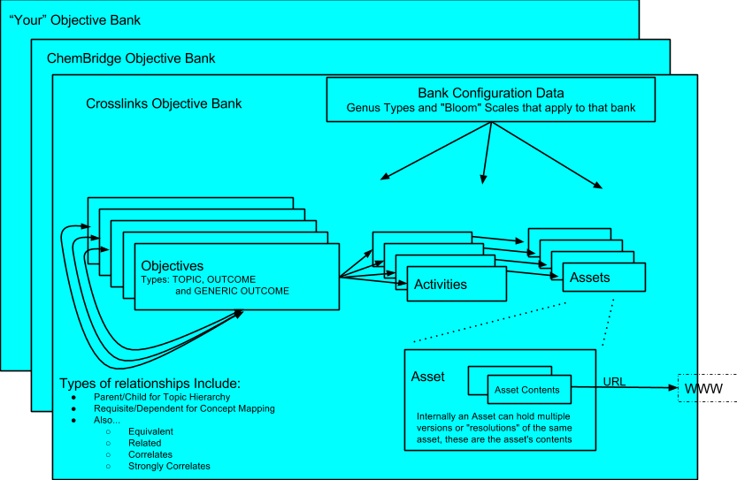
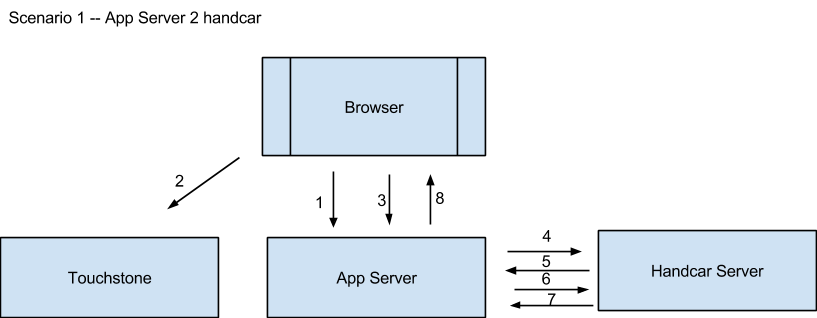
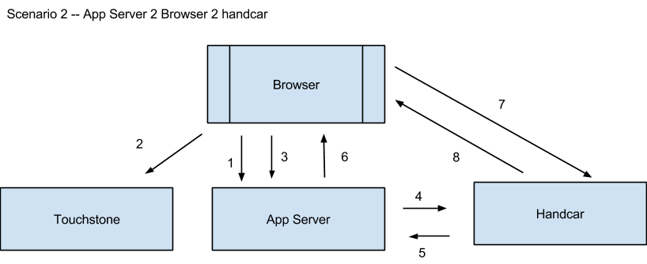
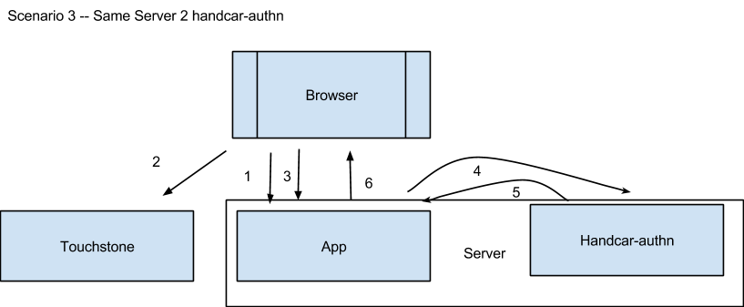
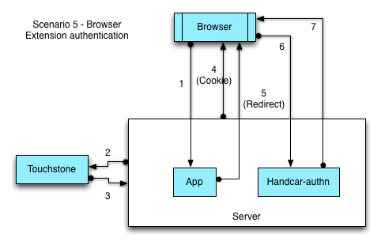

=========================================
MIT's MC3 Handcar Service Developer Guide
=========================================

MIT’s MC3 Handcar Service Developer Guide        Revised 10/22/2013

v1.0

Table of Contents

Welcome to MC3’s Handcar service.  It provides a restful interface to
all of the data managed by MC3.

`Documentation TODOs <#h.s7tah2kjd5n0>`__

`Overview <#h.996gxat6oao>`__

`Known issues/Issues under consideration for implementation in future
releases <#h.5f9zez9fwtyq>`__

`Other Related Documentation <#h.lbsz7n7e221w>`__

`Model Diagram <#h.pbufgfibs83z>`__

`Model Description <#h.toaninro1gjh>`__

`What is the base URL for Handcar? <#h.cen5bu3cyy43>`__

`Objective Banks <#h.w76nwd3k9ry>`__

`Basic Lookup <#h.q2uxp75xouag>`__

`Example #1 Get a list of all objective banks <#h.xq20qkavyz9b>`__

`Example #2 Get the details of a particular objective
bank <#h.j7veey8brw95>`__

`Looking up objects within a bank <#h.8icsvfjrwwu5>`__

`Example #1 Finding all objectives within a bank <#h.vb6ahzqy0xxs>`__

`Example #2 Finding all activities within a bank <#h.khkecvewbigc>`__

`Example #3 Finding all assets tied to a bank <#h.m93v69rox7ux>`__

`Configuration Data <#h.6hlk43td2r4t>`__

`Example #1 Finding all the allowed objective types <#h.c89smzv37yh5>`__

`Example #2 Finding the scaling systems (Bloom’s Taxonomy) used to
categorize the objectives <#h.bg60cwsyjg9n>`__

`Example #3 Getting a description of the grades used in the bloom
types <#h.u5odenv9x2ti>`__

`DoI I have to use Bloom’s Taxonomy? <#h.7ndngegdecax>`__

`Example #4 Finding all the activity types <#h.62g75y7oqfr6>`__

`Example #5 Finding all the asset types <#h.g7sotvizul5k>`__

`Example #6 Finding all the asset content (mime)
types <#h.eqgh1rfljjom>`__

`Example #7 Get a list of all known types <#h.zha3fst9mpqi>`__

`Example #8 Get a list of objective bank types <#h.p17uogumli44>`__

`Example #9 Get a list of Display Text Language Types (and
default) <#h.bswy2dgfimoh>`__

`Example #10 Get a list of Display Text Script Types (and
default) <#h.sma0us1mj2su>`__

`Example #11 Get a list of Display Text Format Types (and
default) <#h.ibx2fp9uf8vk>`__

`Objectives <#h.5o64sgq03dsq>`__

`Basic Lookups <#h.tgzky2nh9t51>`__

`Example #1 Finding all TOPIC objectives within a
bank <#h.fz964swgsxj8>`__

`Example #2 Finding all OUTCOME objectives within a
bank <#h.r7veok8jmrzl>`__

`Example #3 Finding an objective by id within a
bank <#h.83hk8djuvgbs>`__

`Example #4 Finding an objective by id without knowing it’s
bank <#h.8bj10kwgxp2z>`__

`Example #5 Bulk fetching lots of objectives by id <#h.7p06crhkqxdz>`__

`Looking up objectives in a hierarchy <#h.h0si8i9vnelq>`__

`Example #1 Finding the root objectives or just the root ids in the
hierarchy <#h.cynlt1dfkvr6>`__

`Example #2 Finding an objective’s children or just the ids of it’s
children <#h.qfvhfwhl7onz>`__

`Example #3 Finding an objective’s parent(s) or just the ids of it’s
parent(s) <#h.d1jos2fy0dm0>`__

`Example #4 Bulk fetching of an objective’s children, grandchildren,
great-grandchildren, etc 10 levels deep <#h.stumd139bkdw>`__

`Looking up requisite and dependent objectives <#h.a3by23pzo46i>`__

`Example #1 Finding the beginner objectives or just the beginner ids for
the bank <#h.vx79jbozendo>`__

`Example #2 Finding an objective’s immediately preceding requisite
objectives <#h.ou4sug336x75>`__

`Example #3 Finding the objectives that are immediately dependent on a
particular objective <#h.9z08eaeljlia>`__

`Example #4 Bulk fetching of an objective’s dependents, that dependent’s
dependent’s, etc 10 levels deep <#h.2sqfdww2v6or>`__

`Activities <#h.qzorl5k1vyta>`__

`Basic Lookup <#h.g0k3t1rl1wed>`__

`Example #1 Fetch all the activities in the bank <#h.ev89spv5hjtp>`__

`Example #2 Fetch all the activities for an
objective <#h.pvekfb6vlfln>`__

`Example #3 Fetch a particular activity by ID <#h.8mqxu7rmfg98>`__

`Example #4 Fetch a Particular Activity Without Specifying the
Bank <#h.h4kdjktzasz4>`__

`Example #5 Bulk Fetch Activities by specifying multiple
IDs <#h.wpsusudn6xec>`__

`Looking up related objects <#h.r15ysvvrppzk>`__

`Example #1 Fetch a Particular Activity’s Asset IDs <#h.rzjgytbh3cnv>`__

`Example #2 Fetch a Particular Activity’s Assets <#h.o9i2bioghx3a>`__

`Assets <#h.osi6k1tolxk2>`__

`Basic Lookup <#h.im1mrhew3g2d>`__

`Example #1 Fetch all Assets associated with an objective bank
optionally restricted by Genus type(s) <#h.1dvorqwr6so2>`__

`Example #2 Fetch a particular asset from a bank <#h.ar1uddxgprgv>`__

`Example #3 Fetch a particular asset without Specifying
Bank <#h.wks6ov3dnyw8>`__

`Example #4 Bulk Fetch Multiple Particular Assets Within an Objective
Bank by ID <#h.vfrrno9hrh6h>`__

`Example #5 Fetch a Particular Objective Asset’s Branding
Information <#h.k1aus795lg9u>`__

`Cross Bank Support <#h.bgktsnbdk9oj>`__

`Example #1 Finding an objective by id without specifying its
bank <#h.epiozgutyoww>`__

`Example #2 Finding an activity by id without specifying its
bank <#h.hskmllup06cd>`__

`Example #3 Finding an asset by id without specifying its
bank <#h.dtrh0iathbg4>`__

`Extension Records <#h.b3b9bhvvhop2>`__

`What is an extension record? <#h.4zc3fofosfbs>`__

`Example #1 Fetch a Particular Objective Bank’s Extension
Record <#h.1cdtdkxxttab>`__

`Example #2 Fetch a Particular Objective’s Extension
Record <#h.ysqzs35aiyed>`__

`Example #3 Fetch a Particular Activity’s Extension
Record <#h.k9a9q32lhl4>`__

`Example #4 Fetch a Particular Asset’s Extension
Record <#h.7n39o2hsukwr>`__

`Example #5 Fetch a Particular Asset Content’s Extension
Record <#h.tc4061njbf9x>`__

`Administration  -- Creating and Updating Objects in
Handcar <#h.q50l0stylfy5>`__

`A Word about Types <#h.k1hzazwpw71r>`__

`List of Common “Handy Dandy” Types <#h.jf6fg64jh7jh>`__

`How can I get my own objective bank in the production tier on
MC3? <#h.37x8auwjo6wa>`__

`Creating a “Sandbox” Objective Bank in MC3-DEMO <#h.kay4t2nml9j2>`__

`What information do I need to supply  to create a Sandbox objective
bank? <#h.jyfht9pg2ksv>`__

`A Json example for creating a sandbox bank <#h.ubi83o7j4j3l>`__

`A Python example for creating a sandbox bank <#h.8urc1fk36cwv>`__

`You can create and update 3 kinds (types) of
Objectives <#h.jlbcb515693j>`__

`Wait... What is a Generic Outcome again? <#h.mrg4rycyfen0>`__

`What information do I need to supply to create a
Topic? <#h.qbgol1mf5dc5>`__

`A JSON Example for creating a topic <#h.6gdyxmdxjfup>`__

`What information do I need to supply to create an
Outcome? <#h.2kl6e7h1frz3>`__

`A Json Example for creating an Outcome <#h.pxpn7cmsftny>`__

`What information do I need to supply to create a Generic
Outcome? <#h.gets2c886mm9>`__

`A Json Example for creating an Outcome <#h.fz3ud72gvvbn>`__

`How do I add the new GENERIC OUTCOME as a child to the
topic? <#h.wghkhj7ui5b4>`__

`A simple Javascript example for creating an
objective <#h.kqw6f27zd93p>`__

`A more complete example in Python <#h.24lbs584p4hg>`__

`Creating and Updating Activities <#h.kxqvvqlwd0uv>`__

`What is the minimum information needed to create an
activity? <#h.pasgczbr4cn1>`__

`Creating a Generic Activity <#h.muq8kk50r6kr>`__

`A Javascript example <#h.wfh5nt4l3mhi>`__

`A Python Example <#h.lqk5wldlpha4>`__

`Creating and Updating Assets <#h.4v4u9133q970>`__

`What is the minimum information needed to create an
asset? <#h.7j4avzki2as8>`__

`Administration -- Deleting objects <#h.azrcbvt1o520>`__

`Delete Objective Bank <#h.wg4wdaijfwu0>`__

`Example #1 Delete an Objective Bank <#h.481vlvlmdo5w>`__

`What happens when I delete an objective bank? <#h.7ogm2lufs66h>`__

`Delete Objective <#h.cmva3wpyspc7>`__

`Example #1 Delete an Objective <#h.hgyvok77yii>`__

`What happens when I delete an objective? <#h.qmagvsyrru9e>`__

`Delete Activity <#h.t65xgn7h0d2l>`__

`Example #1 Delete an Activity <#h.emyd9tv6oj6o>`__

`What happens when I delete an activity? <#h.pemseyv1svlw>`__

`Delete Asset <#h.ekxoy8koxp5q>`__

`Example #1 Delete an Asset <#h.9zp91fxjwf99>`__

`What happens when I delete an asset? <#h.g0vblvemcag9>`__

`Delete Asset Content <#h.67yv9sko40qt>`__

`Example #1 Delete an Asset Content <#h.sqhbwz8f61ud>`__

`What happens when I delete an asset content? <#h.akerng79ctc3>`__

`Delete a Relationship Family <#h.qgj4352w84uh>`__

`Delete a Relationship <#h.p38ch2pa60mf>`__

`What happens when I delete a Relationship? <#h.sd2e7nb0s2ke>`__

`Two Authentication Mechanisms <#h.8ndjynonwsnf>`__

`Which authentication mechanism should I use? <#h.4lbg9yg2d5yw>`__

`Authentication Use Cases <#h.2kr34fs7at42>`__

`Scenario 1 -- The Application Server talks directly to
handcar <#h.dfgfe56l4ehx>`__

`Scenario 2 -- Application Server constructs key for user, sends to
Browser so it can talk to Handcar <#h.hz6u4naokis3>`__

`Scenario 3 -- Application is running on same server as Handcar and
talks to handcar server to server <#h.k2wejbg1ogu3>`__

`Scenario 4  -- application is running on same server as handcar and
browser uses touchstone cookies to talk to handcar <#h.ddwf793rmk29>`__

`Ok, my app can authenticate to handcar but how can I get Touchstone to
authenticate users to my app? <#h.sjh8qdq30n8y>`__

`Authenticating to Handcar via Touchstone <#h.vdfouik4h6hb>`__

`Can non-MIT users use my application? <#h.gno9iib9vbrm>`__

`What about Touchstone Collaboration accounts and InCommon
accounts? <#h.buezlqvz07t7>`__

`Authenticating to Handcar using Agent Keys <#h.hs17slic26si>`__

`What do these keys look like? <#h.986w24u0vxm5>`__

`Expiration Date <#h.xxkaw7ik2m31>`__

`Can anyone construct these keys? <#h.ubr6r0la1nw1>`__

`Applications can have keys too? <#h.ujp9huxjftvt>`__

`I’m writing an application, can I get an app key? <#h.yz36wrgumovs>`__

`“Quasi” Permanent Keys <#h.k5xadl2pm5j1>`__

`Using Proxy Name to make an authenticated request <#h.cffo1af7q8yk>`__

`Example #1 Construct an Agent for a user <#h.ap3bk9fpj4i8>`__

`Example #2 Check if an Agent Key is (still) valid <#h.vpcpicvwspj1>`__

`Authorization <#h.qgxwo8wsk5px>`__

`The MC3$GUEST account <#h.pikde4gug6p>`__

`MIT Roles <#h.hlqksdicls04>`__

`Qualifiers <#h.2fdv3pizhy77>`__

`What if a user has no authorizations? <#h.qiqp9jitevm1>`__

`Authorization Hints <#h.d186m52bwpg>`__

`Example #1 getting authorization hints for MC3GUE$T for the Chembridge
bank <#h.8n7s47l2jz70>`__

`Example #2 getting your own authorization hints for the Chembridge
bank <#h.i2gt0j7rsjox>`__

`The Relationship Service <#h.cf029iro3bkl>`__

`Introduction <#h.gdtf37k4gpnv>`__

`If I can do pretty much everything I need via the learning service, why
would I use the relationship service? <#h.z2na5ssb0r0>`__

`If I can do pretty much everything I need via the relationship service,
why would I use the learning service? <#h.exchr042d1zu>`__

`Can I use both in the same application?  (Do the two services really
update the same data?) <#h.t4v0ouvb0d34>`__

`Basic Lookup <#h.c77d6gt406yb>`__

`Example #1 Getting the Family Id for the corresponding Objective Bank
Id and vice versa <#h.kyteu2wbg6jm>`__

`Example #2 Get a list of all the families of
relationships <#h.2p5fbywwvu22>`__

`Example #3 Get a single family by Id <#h.6u1q1txvekqj>`__

`Example #4 Get a list of all of all relationships in a family,
optionally by relationship type <#h.5be389di0dx>`__

`Example #5 Get a particular relationship <#h.bejadt3vtiu1>`__

Documentation TODOs
===================

#. Change all the URLs to MC3-DEMO instead of OKI-DEV
#. Test and change many of the ids in the URLS because many are no
   longer valid
#. Add the appropriate copyright clause to this documentation
#. Get Cole to document how to supply touchstone cookies for browser
   applications to authenticate to handcar from same server

Overview
========

This handcar service supports a restful JSON interface to the MC3
system's learning objectives.  Handcar uses
`Moxy <http://wiki.eclipse.org/EclipseLink/Examples/MOXy/MOXy_JSON_Provider>`__\ to
serialize the objects into JSON.

Known issues/Issues under consideration for implementation in future releases
-----------------------------------------------------------------------------

These items are known issues that are under consideration for
implementation in future releases.

#. Free form querying using keywords to find objectives is not supported
#. Managing the configuration data for a bank directly via Handcar
#. Providing a metadata so the UI can dynamically validate data values
#. Support for assessments
#. Managing assets directly via a separate repository service
#. Support for additional asset content types (mime types)
#. You cannot store additional information such as name, description or
   extensions on Parent-Child relationships
#. Getting branding information about a bank or an asset is not yet
   supported
#. Cross bank relationships will not be blocked in all situations but
   they are not fully supported as many details remain to be worked out.

Other Related Documentation
---------------------------

Detailed documentation on all of the methods and data elements is
contained in “Contract Docs” which fully explain the contract.

See
`http://oki-dev.mit.edu/handcar/contractdocs/ <http://oki-dev.mit.edu/handcar/contractdocs/>`__

--------------

Model Diagram
-------------

|image0|

Model Description
-----------------

Banks contain three main types of objects:

-  `Objectives <#h.pzxzpdsydj9e>`__-- Learning Objectives which come in
   three distinct types:

-  Topics -- also called concepts which define an area of knowledge ,
   typically expressed as NOUNS
-  Outcomes -- which are specific learning goals, typically expressed
   starting with VERBS
-  Generic Outcomes -- which are outcomes that hold no real data
   themselves but are there to simply tie together topics and content
   via a bloom type -- For example if the topic is “Derivative” a
   generic outcome could be “Learn Derivative”

-  `Activities <#h.bycu3aaffge7>`__ which are tied to objectives - that
   a student may do in order to master the objective
-  `Assets <#h.h08m2wx23t1l>`__ which are tied to activities -- that are
   typically the content that a student consumes as part of the activity

-  In the model a single asset have multiple “Asset Contents” which may
   be different resolutions of the same asset, for example the same
   asset can have a thumbnail representation and full size JPG versions
   of the same picture.

-  `Relationships <https://oki-dev.mit.edu/handcar/contractdocs/RelationshipBean.html>`__ --
   Alternative View of Relationships between objectives, see `The
   Relationship Service <#h.cf029iro3bkl>`__

Additionally there are configuration “types” and “grade scales” used to
organize and categorize these three main objects.

For a detailed description of each of these objects and data fields see
the `Contract
Documentation <http://oki-dev.mit.edu/handcar/contractdocs/>`__

What is the base URL for Handcar?
=================================

There are two servers each of which have two URLs

` <#>`__\ ` <#>`__

Guest access or use Agent Keys for authentication

Requires Touchstone Authentication

Production Tier

-  Used for live applications
-  Data is never refreshed
-  Uses MIT ROLES for authorization
-  Cannot create new objective banks

`https://mc3.mit.edu/handcar/ <https://mc3.mit.edu/handcar/>`__

`https://mc3.mit.edu/handcar-authn/ <https://mc3.mit.edu/handcar-authn/>`__

Demo/Test Tier

-  Used for testing and demonstrations
-  Data is refreshed periodically
-  Uses TEST-ROLES  for authorization
-  Can create new SANDBOX objective banks

`https://mc3-demo.mit.edu/handcar/ <https://mc3-demo.mit.edu/handcar/>`__

`https://mc3-demo.mit.edu/handcar-authn/ <https://mc3-demo.mit.edu/handcar-authn/>`__

--------------

Objective Banks
===============

All data is organized into collections called objective banks.  Right
now we have several such banks, for example: Crosslinks, ChemBridge, and
i2.002 and EDC.  These are projects where MIT professors mapped the
concepts of their respective domains.  MC3 is a federated system so we
can add in objectives from other sources easily.  Later we will be
adding additional banks from within and outside of MIT.

Basic Lookup
------------

Example #1 Get a list of all objective banks
~~~~~~~~~~~~~~~~~~~~~~~~~~~~~~~~~~~~~~~~~~~~

`http://oki-dev.mit.edu/handcar/services/learning/objectivebanks <http://oki-dev.mit.edu/handcar/services/learning/objectivebanks>`__ 

Example on\ ` Hurl
It <http://www.hurl.it/hurls/e90060389942ccd3cddd50045a0a7925065dd297/7945e28ff26be22b0a12d6ce0a20698aa3c56343>`__

Example #2 Get the details of a particular objective bank
~~~~~~~~~~~~~~~~~~~~~~~~~~~~~~~~~~~~~~~~~~~~~~~~~~~~~~~~~

`http://oki-dev.mit.edu/handcar/services/learning/objectivebanks/objectivebank%3A1%40MIT-OEIT <http://oki-dev.mit.edu/handcar/services/learning/objectivebanks/objectivebank%3A1%40MIT-OEIT>`__ 

Looking up objects within a bank
--------------------------------

Example #1 Finding all objectives within a bank
~~~~~~~~~~~~~~~~~~~~~~~~~~~~~~~~~~~~~~~~~~~~~~~

`http://oki-dev.mit.edu/handcar/services/learning/objectivebanks/objectivebank%3A1%40MIT-OEIT/objectives <http://oki-dev.mit.edu/handcar/services/learning/objectivebanks/objectivebank%3A1%40MIT-OEIT/objectives>`__

Example #2 Finding all activities within a bank
~~~~~~~~~~~~~~~~~~~~~~~~~~~~~~~~~~~~~~~~~~~~~~~

`http://oki-dev.mit.edu/handcar/services/learning/objectivebanks/objectivebank%3A1%40MIT-OEIT/activities <http://oki-dev.mit.edu/handcar/services/learning/objectivebanks/objectivebank%3A1%40MIT-OEIT/activities>`__

Example #3 Finding all assets tied to a bank
~~~~~~~~~~~~~~~~~~~~~~~~~~~~~~~~~~~~~~~~~~~~

`http://oki-dev.mit.edu/handcar/services/learning/objectivebanks/objectivebank%3A1%40MIT-OEIT/assets <http://oki-dev.mit.edu/handcar/services/learning/objectivebanks/objectivebank%3A1%40MIT-OEIT/assets>`__

Configuration Data
------------------

Each bank is designed to be configured to support different
categorization schemes and types.

As mentioned above objectives come in two basic varieties or genus
types: TOPIC and OUTCOMES and the default categorization scheme uses
Bloom’s taxonomy.

Example #1 Finding all the allowed objective types
~~~~~~~~~~~~~~~~~~~~~~~~~~~~~~~~~~~~~~~~~~~~~~~~~~

`https://oki-dev.mit.edu/handcar/services/learning/objectivebanks/mc3-objectivebank%3A1%40MIT-OEIT/types/genus/objective <https://oki-dev.mit.edu/handcar/services/learning/objectivebanks/mc3-objectivebank%3A1%40MIT-OEIT/types/genus/objective>`__

Should return three types, one for TOPIC, one for OUTCOMEs and one for a
special type called “GENERIC OUTCOME”

Technically the types for objectives, activities and assets can all be
configured per bank.  In practice, all of our current banks use the same
set of types for these kinds of objects.

Example #2 Finding the scaling systems (Bloom’s Taxonomy) used to categorize the objectives
~~~~~~~~~~~~~~~~~~~~~~~~~~~~~~~~~~~~~~~~~~~~~~~~~~~~~~~~~~~~~~~~~~~~~~~~~~~~~~~~~~~~~~~~~~~

Note: in the literature this is called the “Cognitive Process” scale and
the “Knowledge Category” scale.  see this
`handout <http://www.google.com/url?q=http%3A%2F%2Fwww.celt.iastate.edu%2Fpdfs-docs%2Fteaching%2FRevisedBloomsHandout.pdf&sa=D&sntz=1&usg=AFQjCNHdUp-E85rfxZQ1bm-1ItkOiwXGKg>`__ 
from Iowa State University.  See
`https://oki-dev.mit.edu/handcar-authn/contractdocs/GradeSystemBean.html <https://oki-dev.mit.edu/handcar-authn/contractdocs/GradeSystemBean.html>`__

`https://oki-dev.mit.edu/handcar/services/learning/objectivebanks/mc3-objectivebank%3A1%40MIT-OEIT/gradesystems/cognitiveprocess <https://oki-dev.mit.edu/handcar/services/learning/objectivebanks/mc3-objectivebank%3A1%40MIT-OEIT/gradesystems/cognitiveprocess>`__

`https://oki-dev.mit.edu/handcar/services/learning/objectivebanks/mc3-objectivebank%3A1%40MIT-OEIT/gradesystems/knowledgecategory <https://oki-dev.mit.edu/handcar/services/learning/objectivebanks/mc3-objectivebank%3A1%40MIT-OEIT/gradesystems/knowledgecategory>`__

Example #3 Getting a description of the grades used in the bloom types
~~~~~~~~~~~~~~~~~~~~~~~~~~~~~~~~~~~~~~~~~~~~~~~~~~~~~~~~~~~~~~~~~~~~~~

This gets all the grades

`https://oki-dev.mit.edu/handcar/services/learning/objectivebanks/mc3-objectivebank%3A1%40MIT-OEIT/grades <https://oki-dev.mit.edu/handcar/services/learning/objectivebanks/mc3-objectivebank%3A1%40MIT-OEIT/grades>`__

This gets information on a particular grade

`https://oki-dev.mit.edu/handcar/services/learning/objectivebanks/mc3-objectivebank%3A1%40MIT-OEIT/grades/mc3.grade.system.cognitive.process.crosslinks%3Amc3.grade.bloom.learn%40MIT-OEIT <https://oki-dev.mit.edu/handcar/services/learning/objectivebanks/mc3-objectivebank%3A1%40MIT-OEIT/grades/mc3.grade.system.cognitive.process.crosslinks%3Amc3.grade.bloom.learn%40MIT-OEIT>`__

Right now this is the only configuration that varies by objective bank.
 Crosslinks banks just have LEARN and APPLY. The EDC bank has no grades
in it’s scale and the rest have the full Bloom taxonomy.

DoI I have to use Bloom’s Taxonomy?
~~~~~~~~~~~~~~~~~~~~~~~~~~~~~~~~~~~

No you do not have to use Bloom’s taxonomy.  Bloom categorization of
objectives is completely optional.

If you want to use a different taxonomy that can be accommodated as
well.  If we create an objective bank for you we can also configure it
with any taxonomy you want.  It can be a subset of Bloom’s, an
alternative to Bloom’s or it can be configured to allow no taxonomy at
all.  Some caveats:

-  We must do the configuration for you -- we do not yet support
   configuration of the bank via the REST interface
-  Some of MC3’s tools are wired to work only with Bloom’s taxonomy and
   may not work as expected if you do not use Bloom’s.

Final note:

-  If you just don’t like the default labeling we used for Bloom then we
   can configure your bank to use Bloom’s keys use your own labeling

-  For example: you may wish to use the word “Knowledge” instead of
   “Remember” to describe the bloom type but underneath they still point
   to the same Bloom category.

Example #4 Finding all the activity types
~~~~~~~~~~~~~~~~~~~~~~~~~~~~~~~~~~~~~~~~~

`http://oki-dev.mit.edu/handcar/services/learning/objectivebanks/objectivebank%3A1%40MIT-OEIT/types/genus/activity <http://oki-dev.mit.edu/handcar/services/learning/objectivebanks/objectivebank%3A1%40MIT-OEIT/types/genus/activity>`__

Note: Right now there is three broad types of activities supported ASSET
BASED, ASSESSMENT BASED and COURSE BASED but the only one currently in
use is the ASSET BASED.

Example #5 Finding all the asset types
~~~~~~~~~~~~~~~~~~~~~~~~~~~~~~~~~~~~~~

`http://oki-dev.mit.edu/handcar/services/learning/objectivebanks/objectivebank%3A1%40MIT-OEIT/types/genus/assets <http://oki-dev.mit.edu/handcar/services/learning/objectivebanks/objectivebank%3A1%40MIT-OEIT/types/genus/assets>`__

Note: Right now there is only one asset type is supported it is an asset
that points to a URL.

Example #6 Finding all the asset content (mime) types
~~~~~~~~~~~~~~~~~~~~~~~~~~~~~~~~~~~~~~~~~~~~~~~~~~~~~

`http://oki-dev.mit.edu/handcar/services/learning/objectivebanks/objectivebank%3A1%40MIT-OEIT/types/genus/assetcontent <http://oki-dev.mit.edu/handcar/services/learning/objectivebanks/objectivebank%3A1%40MIT-OEIT/types/genus/assetcontent>`__

Note: There is a special type for UNKNOWN  FORMAT TYPE.  that you can
use if you don’t know the mime type of the asset.

Note: the list returned right now is NOT complete.  It just contains
TEXT based format types, we will very soon be adding in types, like MPG
for movings and JPG for sound.

Example #7 Get a list of all known types
~~~~~~~~~~~~~~~~~~~~~~~~~~~~~~~~~~~~~~~~

`https://oki-dev.mit.edu/handcar-authn/services/learning/types/ <https://oki-dev.mit.edu/handcar-authn/services/learning/types/>`__

Example #8 Get a list of objective bank types
~~~~~~~~~~~~~~~~~~~~~~~~~~~~~~~~~~~~~~~~~~~~~

`https://oki-dev.mit.edu/handcar-authn/services/learning/objectivebanks/types/genus <https://oki-dev.mit.edu/handcar-authn/services/learning/objectivebanks/types/genus>`__

Example #9 Get a list of Display Text Language Types (and default)
~~~~~~~~~~~~~~~~~~~~~~~~~~~~~~~~~~~~~~~~~~~~~~~~~~~~~~~~~~~~~~~~~~

`https://oki-dev.mit.edu/handcar-authn/services/learning/objectivebanks/mc3-objectivebank%3A2%40MIT-OEIT/types/languages <https://oki-dev.mit.edu/handcar-authn/services/learning/objectivebanks/mc3-objectivebank%3A2%40MIT-OEIT/types/languages>`__

Get the default (english for all the current banks)

`https://oki-dev.mit.edu/handcar-authn/services/learning/objectivebanks/mc3-objectivebank%3A2%40MIT-OEIT/types/languages/default <https://oki-dev.mit.edu/handcar-authn/services/learning/objectivebanks/mc3-objectivebank%3A2%40MIT-OEIT/types/languages/default>`__

Example #10 Get a list of Display Text Script Types (and default)
~~~~~~~~~~~~~~~~~~~~~~~~~~~~~~~~~~~~~~~~~~~~~~~~~~~~~~~~~~~~~~~~~

`https://oki-dev.mit.edu/handcar-authn/services/learning/objectivebanks/mc3-objectivebank%3A2%40MIT-OEIT/types/scripts <https://oki-dev.mit.edu/handcar-authn/services/learning/objectivebanks/mc3-objectivebank%3A2%40MIT-OEIT/types/scripts>`__

Get the default (latin for all the current banks)

`https://oki-dev.mit.edu/handcar-authn/services/learning/objectivebanks/mc3-objectivebank%3A2%40MIT-OEIT/types/scripts/default <https://oki-dev.mit.edu/handcar-authn/services/learning/objectivebanks/mc3-objectivebank%3A2%40MIT-OEIT/types/scripts/default>`__

Example #11 Get a list of Display Text Format Types (and default)
~~~~~~~~~~~~~~~~~~~~~~~~~~~~~~~~~~~~~~~~~~~~~~~~~~~~~~~~~~~~~~~~~

`https://oki-dev.mit.edu/handcar-authn/services/learning/objectivebanks/mc3-objectivebank%3A2%40MIT-OEIT/types/formats <https://oki-dev.mit.edu/handcar-authn/services/learning/objectivebanks/mc3-objectivebank%3A2%40MIT-OEIT/types/formats>`__

Get the default (latin for all the current banks)

`https://oki-dev.mit.edu/handcar-authn/services/learning/objectivebanks/mc3-objectivebank%3A2%40MIT-OEIT/types/formats/default <https://oki-dev.mit.edu/handcar-authn/services/learning/objectivebanks/mc3-objectivebank%3A2%40MIT-OEIT/types/formats/default>`__

--------------

Objectives
==========

Objectives come in two types: TOPICs and OUTCOMEs.

Basic Lookups
-------------

Example #1 Finding all TOPIC objectives within a bank
~~~~~~~~~~~~~~~~~~~~~~~~~~~~~~~~~~~~~~~~~~~~~~~~~~~~~

`http://oki-dev.mit.edu/handcar/services/learning/objectivebanks/objectivebank%3A1%40MIT-OEIT/objectives?genustypeid=mc3-objective%3Amc3.learning.topic%40MIT-OEIT <http://oki-dev.mit.edu/handcar/services/learning/objectivebanks/objectivebank%3A1%40MIT-OEIT/objectives?genustypeid=mc3-objective%3Amc3.learning.topic%40MIT-OEIT>`__

Example #2 Finding all OUTCOME objectives within a bank
~~~~~~~~~~~~~~~~~~~~~~~~~~~~~~~~~~~~~~~~~~~~~~~~~~~~~~~

`http://oki-dev.mit.edu/handcar/services/learning/objectivebanks/objectivebank%3A1%40MIT-OEIT/objectives?genustypeid=mc3-objective%3Amc3.learning.outcome%40MIT-OEIT <http://oki-dev.mit.edu/handcar/services/learning/objectivebanks/objectivebank%3A1%40MIT-OEIT/objectives?genustypeid=mc3-objective%3Amc3.learning.outcome%40MIT-OEIT>`__

Example #3 Finding an objective by id within a bank
~~~~~~~~~~~~~~~~~~~~~~~~~~~~~~~~~~~~~~~~~~~~~~~~~~~

`http://oki-dev.mit.edu/handcar/services/learning/objectivebanks/objectivebank%3A1%40MIT-OEIT/objectives/objective%3A1%40MIT-OEIT <http://oki-dev.mit.edu/handcar/services/learning/objectivebanks/objectivebank%3A1%40MIT-OEIT/objectives/objective%3A1%40MIT-OEIT>`__

Example #4 Finding an objective by id without knowing it’s bank
~~~~~~~~~~~~~~~~~~~~~~~~~~~~~~~~~~~~~~~~~~~~~~~~~~~~~~~~~~~~~~~

You can also find an objective (given an Id even if you do not know the
objective bank where it is stored.
`http://oki-dev.mit.edu/handcar/services/learning/objectives/objective%3A1%40MIT-OEIT <http://oki-dev.mit.edu/handcar/services/learning/objectives/objective%3A1%40MIT-OEIT>`__

Example #5 Bulk fetching lots of objectives by id
~~~~~~~~~~~~~~~~~~~~~~~~~~~~~~~~~~~~~~~~~~~~~~~~~

If you have a list of ids for objectives in a bank and you want to fetch
them all at once you can do this by specifying BULK in the url then
listing the ids as query parameters.

`http://oki-dev.mit.edu/handcar/services/learning/objectivebanks/objectivebank%3A1%40MIT-OEIT/objectives/bulk?id=objective%3A1%40MIT-OEIT&id=objective%3A14%40MIT-OEIT&id=objective%3A27%40MIT-OEIT <http://oki-dev.mit.edu/handcar/services/learning/objectivebanks/objectivebank%3A1%40MIT-OEIT/objectives/bulk?id=objective%3A1%40MIT-OEIT&id=objective%3A14%40MIT-OEIT&id=objective%3A27%40MIT-OEIT>`__

Looking up objectives in a hierarchy
------------------------------------

Topics are often nested or organized into a hierarchy so that they have
parents and children so that topics may have sub-topics and
sub-sub-topics finally ending in specific outcomes.  Note: Although the
typical pattern is that topics have parent child relationships, the
system also supports the creations of outcomes that themselves have
child children.

Example #1 Finding the root objectives or just the root ids in the hierarchy
~~~~~~~~~~~~~~~~~~~~~~~~~~~~~~~~~~~~~~~~~~~~~~~~~~~~~~~~~~~~~~~~~~~~~~~~~~~~

`http://oki-dev.mit.edu/handcar/services/learning/objectivebanks/objectivebank%3A1%40MIT-OEIT/objectives/roots <http://oki-dev.mit.edu/handcar/services/learning/objectivebanks/objectivebank%3A1%40MIT-OEIT/objectives/roots>`__

This returns the root objectives AND it’s children down to a depth of 10
levels deep.  This is called an “ObjectiveNode” because contains all the
fields of an objective but also contains three extra fields:

-  isRoot -- indicates if this is an absolute root in the underlying
   representation
-  isLeaf -- indicates if this is an absolute leaf in the underlying
   representation
-  List of the objective’s children but with these

You can optionally add a query parameter “descendentlevels” to restrict
or expand the levels down it goes down.  For example this gets just the
root objectives with no children.

`https://oki-dev.mit.edu/handcar/services/learning/objectivebanks/objectivebank%3A2%40MIT-OEIT/objectives/roots?descendentlevels=0 <https://oki-dev.mit.edu/handcar/services/learning/objectivebanks/objectivebank%3A2%40MIT-OEIT/objectives/roots?descendentlevels=0>`__

You can also just get the ids of the root objectives

`http://oki-dev.mit.edu/handcar/services/learning/objectivebanks/objectivebank%3A1%40MIT-OEIT/objectives/rootids <http://oki-dev.mit.edu/handcar/services/learning/objectivebanks/objectivebank%3A1%40MIT-OEIT/objectives/rootids>`__

Example #2 Finding an objective’s children or just the ids of it’s children
~~~~~~~~~~~~~~~~~~~~~~~~~~~~~~~~~~~~~~~~~~~~~~~~~~~~~~~~~~~~~~~~~~~~~~~~~~~

`http://oki-dev.mit.edu/handcar/services/learning/objectivebanks/objectivebank%3A1%40MIT-OEIT/objectives/objective%3A1%40MIT-OEIT/children <http://oki-dev.mit.edu/handcar/services/learning/objectivebanks/objectivebank%3A1%40MIT-OEIT/objectives/objective%3A1%40MIT-OEIT/children>`__

`http://oki-dev.mit.edu/handcar/services/learning/objectivebanks/objectivebank%3A1%40MIT-OEIT/objectives/objective%3A1%40MIT-OEIT/childids <http://oki-dev.mit.edu/handcar/services/learning/objectivebanks/objectivebank%3A1%40MIT-OEIT/objectives/objective%3A1%40MIT-OEIT/childids>`__

Example #3 Finding an objective’s parent(s) or just the ids of it’s parent(s)
~~~~~~~~~~~~~~~~~~~~~~~~~~~~~~~~~~~~~~~~~~~~~~~~~~~~~~~~~~~~~~~~~~~~~~~~~~~~~

`http://oki-dev.mit.edu/handcar/services/learning/objectivebanks/objectivebank%3A1%40MIT-OEIT/objectives/objective%3A2%40MIT-OEIT/parents <http://oki-dev.mit.edu/handcar/services/learning/objectivebanks/objectivebank%3A1%40MIT-OEIT/objectives/objective%3A2%40MIT-OEIT/parents>`__

`http://oki-dev.mit.edu/handcar/services/learning/objectivebanks/objectivebank%3A1%40MIT-OEIT/objectives/objective%3A2%40MIT-OEIT/parentids <http://oki-dev.mit.edu/handcar/services/learning/objectivebanks/objectivebank%3A1%40MIT-OEIT/objectives/objective%3A2%40MIT-OEIT/parentids>`__

Note: most objectives have just ONE parent but the system allows for a
topic to fall under multiple parents, for example ROBOTICS might have
both COMPUTER SCIENCE and MECHANICAL ENGINEERING as parents.

Example #4 Bulk fetching of an objective’s children, grandchildren, great-grandchildren, etc 10 levels deep
~~~~~~~~~~~~~~~~~~~~~~~~~~~~~~~~~~~~~~~~~~~~~~~~~~~~~~~~~~~~~~~~~~~~~~~~~~~~~~~~~~~~~~~~~~~~~~~~~~~~~~~~~~~

`http://oki-dev.mit.edu/handcar/services/learning/objectivebanks/objectivebank%3A1%40MIT-OEIT/objectives/objective%3A1%40MIT-OEIT/children/bulk <http://oki-dev.mit.edu/handcar/services/learning/objectivebanks/objectivebank%3A1%40MIT-OEIT/objectives/objective%3A1%40MIT-OEIT/children/bulk>`__

You may also optionally specify the depth of the hierarchy to return by
supplying a query parameter  “?descendentlevels={n}” so that this
returns just the objective with no children.

`http://oki-dev.mit.edu/handcar/services/learning/objectivebanks/objectivebank%3A1%40MIT-OEIT/objectives/objective%3A1%40MIT-OEIT/children/bulk?descendentlevels=0 <http://oki-dev.mit.edu/handcar/services/learning/objectivebanks/objectivebank%3A1%40MIT-OEIT/objectives/objective%3A1%40MIT-OEIT/children/bulk?descendentlevels=0>`__

Looking up requisite and dependent objectives
---------------------------------------------

Objectives can also be organized into chains of pre-REQUISITES.  These
are objectives that typically must be mastered before attempting to
master the current objective.

Example #1 Finding the beginner objectives or just the beginner ids for the bank
~~~~~~~~~~~~~~~~~~~~~~~~~~~~~~~~~~~~~~~~~~~~~~~~~~~~~~~~~~~~~~~~~~~~~~~~~~~~~~~~

These are just the objectives in the bank that do not have any REQUISITE
objectives defined.

`http://oki-dev.mit.edu/handcar/services/learning/objectivebanks/objectivebank%3A1%40MIT-OEIT/objectives/beginners <http://oki-dev.mit.edu/handcar/services/learning/objectivebanks/objectivebank%3A1%40MIT-OEIT/objectives/beginners>`__

This gets the beginner objectives down to 10 levels deep to restrict or
increase the levels you can add an optional query parameter
“descendentlevels”

`https://oki-dev.mit.edu/handcar/services/learning/objectivebanks/objectivebank%3A1%40MIT-OEIT/objectives/beginners?descendentlevels=0 <https://oki-dev.mit.edu/handcar/services/learning/objectivebanks/objectivebank%3A1%40MIT-OEIT/objectives/beginners?descendentlevels=0>`__

You can also just get the begnner ids.

`http://oki-dev.mit.edu/handcar/services/learning/objectivebanks/objectivebank%3A1%40MIT-OEIT/objectives/beginnerids <http://oki-dev.mit.edu/handcar/services/learning/objectivebanks/objectivebank%3A1%40MIT-OEIT/objectives/beginnerids>`__

Example #2 Finding an objective’s immediately preceding requisite objectives
~~~~~~~~~~~~~~~~~~~~~~~~~~~~~~~~~~~~~~~~~~~~~~~~~~~~~~~~~~~~~~~~~~~~~~~~~~~~

For example: Anti-derivative has three requisites: Function, Derivative,
and Differential

`http://oki-dev.mit.edu/handcar/services/learning/objectivebanks/objectivebank%3A1%40MIT-OEIT/objectives/objective%3A1%40MIT-OEIT/requisites <http://oki-dev.mit.edu/handcar/services/learning/objectivebanks/objectivebank%3A1%40MIT-OEIT/objectives/objective%3A1%40MIT-OEIT/requisites>`__

`http://oki-dev.mit.edu/handcar/services/learning/objectivebanks/objectivebank%3A1%40MIT-OEIT/objectives/objective%3A1%40MIT-OEIT/requisiteids <http://oki-dev.mit.edu/handcar/services/learning/objectivebanks/objectivebank%3A1%40MIT-OEIT/objectives/objective%3A1%40MIT-OEIT/requisiteids>`__

Example #3 Finding the objectives that are immediately dependent on a particular objective
~~~~~~~~~~~~~~~~~~~~~~~~~~~~~~~~~~~~~~~~~~~~~~~~~~~~~~~~~~~~~~~~~~~~~~~~~~~~~~~~~~~~~~~~~~

`http://oki-dev.mit.edu/handcar/services/learning/objectivebanks/objectivebank%3A1%40MIT-OEIT/objectives/objective%3A134%40MIT-OEIT/dependents <http://oki-dev.mit.edu/handcar/services/learning/objectivebanks/objectivebank%3A1%40MIT-OEIT/objectives/objective%3A134%40MIT-OEIT/dependents>`__

`http://oki-dev.mit.edu/handcar/services/learning/objectivebanks/objectivebank%3A1%40MIT-OEIT/objectives/objective%3A134%40MIT-OEIT/dependentids <http://oki-dev.mit.edu/handcar/services/learning/objectivebanks/objectivebank%3A1%40MIT-OEIT/objectives/objective%3A134%40MIT-OEIT/dependentids>`__

Example #4 Bulk fetching of an objective’s dependents, that dependent’s dependent’s, etc 10 levels deep
~~~~~~~~~~~~~~~~~~~~~~~~~~~~~~~~~~~~~~~~~~~~~~~~~~~~~~~~~~~~~~~~~~~~~~~~~~~~~~~~~~~~~~~~~~~~~~~~~~~~~~~

`http://oki-dev.mit.edu/handcar/services/learning/objectivebanks/objectivebank%3A1%40MIT-OEIT/objectives/objective%3A1%40MIT-OEIT/dependents/bulk <http://oki-dev.mit.edu/handcar/services/learning/objectivebanks/objectivebank%3A1%40MIT-OEIT/objectives/objective%3A1%40MIT-OEIT/dependents/bulk>`__

Note: it returns that single objective but also with three extra fields:

-  isRoot -- indicates if this is an absolute root in the underlying
   representation
-  isLeaf -- indicates if this is an absolute leaf in the underlying
   representation
-  List of the objective’s children but with these

You may also optionally specify the depth of the hierarchy to return by
supplying a query parameter “?descendentlevels={n}” like this so that
this returns just the objective with no dependents.

`http://oki-dev.mit.edu/handcar/services/learning/objectivebanks/objectivebank%3A1%40MIT-OEIT/objectives/objective%3A1%40MIT-OEIT/dependents/bulk?descendentlevels=0 <http://oki-dev.mit.edu/handcar/services/learning/objectivebanks/objectivebank%3A1%40MIT-OEIT/objectives/objective%3A1%40MIT-OEIT/dependents/bulk?descendentlevels=0>`__

Activities
==========

Basic Lookup
------------

Example #1 Fetch all the activities in the bank
~~~~~~~~~~~~~~~~~~~~~~~~~~~~~~~~~~~~~~~~~~~~~~~

`https://oki-dev.mit.edu/handcar/services/learning/objectivebanks/mc3-objectivebank%3A1%40MIT-OEIT/activities <https://oki-dev.mit.edu/handcar/services/learning/objectivebanks/mc3-objectivebank%3A1%40MIT-OEIT/activities>`__

Example #2 Fetch all the activities for an objective
~~~~~~~~~~~~~~~~~~~~~~~~~~~~~~~~~~~~~~~~~~~~~~~~~~~~

`https://oki-dev.mit.edu/handcar/services/learning/objectivebanks/mc3-objectivebank%3A1%40MIT-OEIT/objectives/mc3-objective%3A235%40MIT-OEIT/activities <https://oki-dev.mit.edu/handcar/services/learning/objectivebanks/mc3-objectivebank%3A1%40MIT-OEIT/objectives/mc3-objective%3A235%40MIT-OEIT/activities>`__

Example #3 Fetch a particular activity by ID
~~~~~~~~~~~~~~~~~~~~~~~~~~~~~~~~~~~~~~~~~~~~

`https://oki-dev.mit.edu/handcar/services/learning/objectivebanks/mc3-objectivebank%3A1%40MIT-OEIT/activities/mc3-activity%3A222%40MIT-OEIT <https://oki-dev.mit.edu/handcar/services/learning/objectivebanks/mc3-objectivebank%3A1%40MIT-OEIT/activities/mc3-activity%3A222%40MIT-OEIT>`__

Example #4 Fetch a Particular Activity Without Specifying the Bank
~~~~~~~~~~~~~~~~~~~~~~~~~~~~~~~~~~~~~~~~~~~~~~~~~~~~~~~~~~~~~~~~~~

`https://oki-dev.mit.edu/handcar/services/learning/activities/mc3-activity%3A222%40MIT-OEIT <https://oki-dev.mit.edu/handcar/services/learning/activities/mc3-activity%3A222%40MIT-OEIT>`__

Example #5 Bulk Fetch Activities by specifying multiple IDs
~~~~~~~~~~~~~~~~~~~~~~~~~~~~~~~~~~~~~~~~~~~~~~~~~~~~~~~~~~~

`http://oki-dev.mit.edu/handcar/services/learning/objectivebanks/objectivebank%3A1%40MIT-OEIT/activities/bulk?id=activity%3A1%40MIT-OEIT&id=activity%3A2%40MIT-OEIT&id=activity%3A3%40MIT-OEIT <http://oki-dev.mit.edu/handcar/services/learning/objectivebanks/objectivebank%3A1%40MIT-OEIT/activities/bulk?id=activity%3A1%40MIT-OEIT&id=activity%3A2%40MIT-OEIT&id=activity%3A3%40MIT-OEIT>`__

Looking up related objects
--------------------------

Example #1 Fetch a Particular Activity’s Asset IDs
~~~~~~~~~~~~~~~~~~~~~~~~~~~~~~~~~~~~~~~~~~~~~~~~~~

You don’t have to, the asset ids are stored as data fields on the
Activity object!

Example #2 Fetch a Particular Activity’s Assets
~~~~~~~~~~~~~~~~~~~~~~~~~~~~~~~~~~~~~~~~~~~~~~~

`https://oki-dev.mit.edu/handcar/services/learning/objectivebanks/mc3-objectivebank%3A1%40MIT-OEIT/activities/mc3-activity%3A222%40MIT-OEIT/assets <https://oki-dev.mit.edu/handcar/services/learning/objectivebanks/mc3-objectivebank%3A1%40MIT-OEIT/activities/mc3-activity%3A222%40MIT-OEIT/assets>`__

Assets
======

Basic Lookup
------------

Example #1 Fetch all Assets associated with an objective bank optionally restricted by Genus type(s)
~~~~~~~~~~~~~~~~~~~~~~~~~~~~~~~~~~~~~~~~~~~~~~~~~~~~~~~~~~~~~~~~~~~~~~~~~~~~~~~~~~~~~~~~~~~~~~~~~~~~

`http://oki-dev.mit.edu/handcar/services/learning/objectivebanks/objectivebank%3A2%40MIT-OEIT/assets <http://oki-dev.mit.edu/handcar/services/learning/objectivebanks/objectivebank%3A2%40MIT-OEIT/assets>`__

or

`http://oki-dev.mit.edu/handcar/services/learning/objectivebanks/objectivebank%3A2%40MIT-OEIT/assets?genusTypeId=mc3-asset%3Amc3.learning.asset.url%40MIT-OEI <http://oki-dev.mit.edu/handcar/services/learning/objectivebanks/objectivebank%3A2%40MIT-OEIT/assets?genusTypeId=mc3-asset%3Amc3.learning.asset.url%40MIT-OEIT>`__

you can also bulk fetch assets using multiple Genus types by adding
“&genustypeid={genusTypeId2}” etc.

Example #2 Fetch a particular asset from a bank
~~~~~~~~~~~~~~~~~~~~~~~~~~~~~~~~~~~~~~~~~~~~~~~

`http://oki-dev.mit.edu/handcar/services/learning/objectivebanks/objectivebank%3A2%40MIT-OEIT/assets/activity%3A251%40MIT-OEIT <http://oki-dev.mit.edu/handcar/services/learning/objectivebanks/objectivebank%3A2%40MIT-OEIT/assets/activity%3A251%40MIT-OEIT>`__

Example #3 Fetch a particular asset without Specifying Bank
~~~~~~~~~~~~~~~~~~~~~~~~~~~~~~~~~~~~~~~~~~~~~~~~~~~~~~~~~~~

`http://oki-dev.mit.edu/handcar/services/learning/assets/activity%3A251%40MIT-OEIT <http://oki-dev.mit.edu/handcar/services/learning/assets/activity%3A251%40MIT-OEIT>`__

Example #4 Bulk Fetch Multiple Particular Assets Within an Objective Bank by ID
~~~~~~~~~~~~~~~~~~~~~~~~~~~~~~~~~~~~~~~~~~~~~~~~~~~~~~~~~~~~~~~~~~~~~~~~~~~~~~~

`https://oki-dev.mit.edu/handcar/services/learning/objectivebanks/mc3-objectivebank:1@MIT-OEIT/assets/bulk?id=mc3-asset%3A38%40MIT-OEIT&id=mc3-asset%3A39%40MIT-OEIT&id=mc3-asset%3A40%40MIT-OEIT&id=mc3-asset%3A41%40MIT-OEIT <https://oki-dev.mit.edu/handcar/services/learning/objectivebanks/mc3-objectivebank:1@MIT-OEIT/assets/bulk?id=mc3-asset%3A38%40MIT-OEIT&id=mc3-asset%3A39%40MIT-OEIT&id=mc3-asset%3A40%40MIT-OEIT&id=mc3-asset%3A41%40MIT-OEIT>`__

Example #5 Fetch a Particular Objective Asset’s Branding Information
~~~~~~~~~~~~~~~~~~~~~~~~~~~~~~~~~~~~~~~~~~~~~~~~~~~~~~~~~~~~~~~~~~~~

Branding information is not supported yet.

Cross Bank Support
==================

Handcar only supports a handful of methods that perform searches across
multiple objective banks.

You can find an Objective, Activity, or Asset by Id even if you do not
know the objective bank where it is stored.

Example #1 Finding an objective by id without specifying its bank
~~~~~~~~~~~~~~~~~~~~~~~~~~~~~~~~~~~~~~~~~~~~~~~~~~~~~~~~~~~~~~~~~

`http://oki-dev.mit.edu/handcar/services/learning/objectives/objective%3A1%40MIT-OEIT <http://oki-dev.mit.edu/handcar/services/learning/objectives/objective%3A1%40MIT-OEIT>`__

Example #2 Finding an activity by id without specifying its bank
~~~~~~~~~~~~~~~~~~~~~~~~~~~~~~~~~~~~~~~~~~~~~~~~~~~~~~~~~~~~~~~~

`http://oki-dev.mit.edu/handcar/services/learning/activities/activity%3A1%40MIT-OEIT <http://oki-dev.mit.edu/handcar/services/learning/activities/activity%3A1%40MIT-OEIT>`__

Example #3 Finding an asset by id without specifying its bank
~~~~~~~~~~~~~~~~~~~~~~~~~~~~~~~~~~~~~~~~~~~~~~~~~~~~~~~~~~~~~

`http://oki-dev.mit.edu/handcar/services/learning/assets/activity%3A251%40MIT-OEIT <http://oki-dev.mit.edu/handcar/services/learning/assets/activity%3A251%40MIT-OEIT>`__

Extension Records
=================

What is an extension record?
~~~~~~~~~~~~~~~~~~~~~~~~~~~~

Extension records allow you to store and retrieve any arbitrary
information you want in a list of name/value pairs.  You may also
optionally store a label used to describe the data field and a
description.  The storage is NOT a key-value pair in that you may store
multiple values against the same name, that way the “field” can
naturally store a list of values.

These name/value pairs are also organized into record types so you may
fetch and update just the group of extension records that you want to
deal with.

FOR NOW you can ignore those types because only one type of extension
record is supported.  Eventually you could optionally specify one or
more record extension types to return just the groups of key value pairs
that you are interested in by adding an optional query param,
“?recordtypeid=xxxxxx”.

==> To update or set the name/value pairs simply get the extension
record, update the bean adding or updating your name value pairs and
then issuing a PUT on the same URL.

See
`ExtensionRecordBean <https://oki-dev.mit.edu/handcar/contractdocs/ExtensionRecordBean.html>`__\ for
more detailed documentation

Example #1 Fetch a Particular Objective Bank’s Extension Record
~~~~~~~~~~~~~~~~~~~~~~~~~~~~~~~~~~~~~~~~~~~~~~~~~~~~~~~~~~~~~~~

`http://oki-dev.mit.edu/handcar/services/learning/objectivebanks/objectivebank%3A1%40MIT-OEIT/objectives/objective%3A1%40MIT-OEIT/extension <http://oki-dev.mit.edu/handcar/services/learning/objectivebanks/objectivebank%3A1%40MIT-OEIT/objectives/objective%3A1%40MIT-OEIT/extension>`__

Example #2 Fetch a Particular Objective’s Extension Record
~~~~~~~~~~~~~~~~~~~~~~~~~~~~~~~~~~~~~~~~~~~~~~~~~~~~~~~~~~

`http://oki-dev.mit.edu/handcar/services/learning/objectivebanks/objectivebank%3A1%40MIT-OEIT/objectives/objective%3A1%40MIT-OEIT/extension <http://oki-dev.mit.edu/handcar/services/learning/objectivebanks/objectivebank%3A1%40MIT-OEIT/objectives/objective%3A1%40MIT-OEIT/extension>`__

Example #3 Fetch a Particular Activity’s Extension Record
~~~~~~~~~~~~~~~~~~~~~~~~~~~~~~~~~~~~~~~~~~~~~~~~~~~~~~~~~

`http://oki-dev.mit.edu/handcar/services/learning/objectivebanks/objectivebank%3A1%40MIT-OEIT/activities/activity%3A1%40MIT-OEIT/extension <http://oki-dev.mit.edu/handcar/services/learning/objectivebanks/objectivebank%3A1%40MIT-OEIT/activities/activity%3A1%40MIT-OEIT/extension>`__

Example #4 Fetch a Particular Asset’s Extension Record
~~~~~~~~~~~~~~~~~~~~~~~~~~~~~~~~~~~~~~~~~~~~~~~~~~~~~~

`http://oki-dev.mit.edu/handcar/services/learning/objectivebanks/objectivebank%3A2%40MIT-OEIT/assets/activity%3A444%40MIT-OEIT/extension <http://oki-dev.mit.edu/handcar/services/learning/objectivebanks/objectivebank%3A2%40MIT-OEIT/assets/activity%3A444%40MIT-OEIT/extension>`__

Example #5 Fetch a Particular Asset Content’s Extension Record
~~~~~~~~~~~~~~~~~~~~~~~~~~~~~~~~~~~~~~~~~~~~~~~~~~~~~~~~~~~~~~

`http://oki-dev.mit.edu/handcar/services/learning/objectivebanks/objectivebank%3A2%40MIT-OEIT/assets/activity%3A444%40MIT-OEIT/assetcontent/activity%3A444%40MIT-OEIT/extension <http://oki-dev.mit.edu/handcar/services/learning/objectivebanks/objectivebank%3A2%40MIT-OEIT/assets/activity%3A444%40MIT-OEIT/assetcontent/activity%3A444%40MIT-OEIT/extension>`__

--------------

Administration  -- Creating and Updating Objects in Handcar
===========================================================

A Word about Types
------------------

Handcar uses “types” to organize and categorize the various objects it
manages.

==>  ALL OBJECTS MUST BE ASSIGNED A TYPE.

You can query the configuration (see above) to find out which types that
are allowed for your particular objective bank.  However there are ones
that are commonly used across banks.  You should create a “constants”
file to hold these types to make it easier to create objects in the
system.

List of Common “Handy Dandy” Types
~~~~~~~~~~~~~~~~~~~~~~~~~~~~~~~~~~

` <#>`__\ ` <#>`__

Applies to

Name

Value

Objective Banks

Sandbox Bank

mc3-objectivebank%3Amc3.learning.objectivebank.sandbox%40MIT-OEIT

Objectives

Topic

mc3-objective%3Amc3.learning.topic%40MIT-OEIT

Objectives

Outcome

mc3-objective%3Amc3.learning.outcome%40MIT-OEIT

Objectives

Generic Outcome

mc3-objective%3Amc3.learning.generic.outcome%40MIT-OEIT

Activity

Asset Based Activity

mc3-activity%3Amc3.learning.activity.asset.based%40MIT-OEIT

Activity

Generic Activity

mc3-activity%3Amc3.learning.activity.generic%40MIT-OEIT

Asset

URL Based Asset

mc3-asset%3Amc3.learning.asset.url%40MIT-OEIT

Asset Content

(mime type)

Unknown (unspecified)

mc3-asset-content%3Amc3.learning.asset.content.unknown%40MIT-OEIT

Display Text Format

Plain Text

Text+Formats%3Aplain%40okapia.net

Display Text Format

HTML + Latex

Text+Formats%3AHTML%2BLaTeX%40okapia.net

Display Text Language

English

639-2%3AEnglish%40ISO

Display Text Script

Latin

15924%3ALatin%40ISO

Cognitive Process

Analyze

mc3.grade.system.cognitive.processes.bloom.revised%3Amc3.grade.bloom.analyze%40MIT-OEIT

Cognitive Process

Create

mc3.grade.system.cognitive.processes.bloom.revised%3Amc3.grade.bloom.create%40MIT-OEIT

Cognitive Process

Evaluate

mc3.grade.system.cognitive.processes.bloom.revised%3Amc3.grade.bloom.evaluate%40MIT-OEIT

Cognitive Process

Learn

mc3.grade.system.cognitive.processes.bloom.revised%3Amc3.grade.bloom.learn%40MIT-OEIT

Cognitive Process

Remember

mc3.grade.system.cognitive.processes.bloom.revised%3Amc3.grade.bloom.remember%40MIT-OEIT

Knowledge Category

Factual

mc3.grade.system.knowlege.categories.bloom.revised%3Amc3.grade.factual%40MIT-OEIT

Knowledge Category

Procedural

mc3.grade.system.knowlege.categories.bloom.revised%3Amc3.grade.procedural%40MIT-OEIT

Knowledge Category

Meta-cognitive

mc3.grade.system.knowlege.categories.bloom.revised%3Amc3.grade.metacognitive%40MIT-OEIT

Knowledge Category

Conceptual

mc3.grade.system.knowlege.categories.bloom.revised%3Amc3.grade.conceptual%40MIT-OEIT

How can I get my own objective bank in the production tier on MC3?
------------------------------------------------------------------

MC3 was designed to support MIT faculty and their academic interests.
 If you are a faculty member (or work with one) simply send  us an email
at
`handcar-help@mailman.mit.edu <mailto:handcar-help@mailman.mit.edu>`__ and
we will set one up for you immediately.  If you are not a faculty member
but are part of the larger MIT community then we can probably support
you as well.  If you are not part of the MIT community please contact us
anyway and we may be able to work out some sort of other arrangement.

Creating a “Sandbox” Objective Bank in MC3-DEMO
-----------------------------------------------

Objective Banks cannot be directly created by end users in the
production tier (MC3) but Sandbox banks can be created in the DEMO tier
(MC3-DEMO).

Some cautions

#. If you create a sandbox bank, it is NOT PRIVATE, anyone else can see
   it and update the data in it.
#. Periodically we the data in MC3-DEMO with data from MC3 - when we do
   this your SANDBOX bank will disappear.

What information do I need to supply  to create a Sandbox objective bank?
~~~~~~~~~~~~~~~~~~~~~~~~~~~~~~~~~~~~~~~~~~~~~~~~~~~~~~~~~~~~~~~~~~~~~~~~~

There are only two things you need to supply:

#. DisplayName = “Unique Name for your bank”
#. GenusType =
   mc3-objectivebank%3Amc3.learning.objectivebank.sandbox%40MIT-OEIT

==> The Display Name must be unique otherwise the POST will return the
existing sandbox bank with that name.

A Json example for creating a sandbox bank
~~~~~~~~~~~~~~~~~~~~~~~~~~~~~~~~~~~~~~~~~~

Issue a POST with that data to
`https://oki-dev.mit.edu/handcar/services/learning/objectivebanks <https://oki-dev.mit.edu/handcar/services/learning/objectivebanks>`__

'{"displayName": {"text": "Your unique name here"}, "genusTypeId":
"mc3-objectivebank%3Amc3.learning.objectivebank.sandbox%40MIT-OEIT" }’

The following fields are optional

#. Description
#. DisplayText metadata fields are not processed when posting and the
   defaults for the bank are used.

#. formatTypeId
#. languageTypeId
#. scriptTypeId

A Python example for creating a sandbox bank
~~~~~~~~~~~~~~~~~~~~~~~~~~~~~~~~~~~~~~~~~~~~

 The bean may be fully configured following the template below (note the
genusTypeId):

        bank\_bean = {

                    '@type':'objectiveBankBean',

                    'id': '',

                    'current': True,

                    'description':{

                           
'formatTypeId':'Text+Formats%3Aplain%40okapia.net',

                            'languageTypeId':'639-2%3AEnglish%40ISO',

                            'scriptTypeId':'15924%3ALatin%40ISO',

                            'text': new\_class\_name

                    },

                    'displayName':{

                           
'formatTypeId':'Text+Formats%3Aplain%40okapia.net',

                            'languageTypeId':'639-2%3AEnglish%40ISO',

                            'scriptTypeId':'15924%3ALatin%40ISO',

                            'text': new\_class\_number

                    },

                   
'genusTypeId':'mc3-objectivebank%3Amc3.learning.objectivebank.sandbox%40MIT-OEIT'

            }

            mc3\_result = create\_objectivebank( bank\_bean )

Using a web library, you can then POST the bean to the url
‘/handcar/services/learning/objectivebanks/’. Our Python example is
below:

        def create\_objectivebank(bank\_bean):

        post\_args = bank\_bean

        url\_path = ('/handcar/services/learning/objectivebanks/')

        response = \_post\_request(url\_path, post\_args)

        return response.read()

def \_post\_request(url\_path, data\_map):

        connection = httplib.HTTPConnection(HOST)

        data = json.dumps(data\_map)

        connection.request('POST', url\_path, data, {'Content-Type':
'application/json'})

        return connection.getresponse()

You can create and update 3 kinds (types) of Objectives
-------------------------------------------------------

You can create three kinds of objectives:

#. Topic -- typically describes an area of knowledge to be learned --
   typically expressed as a noun
#. Outcome -- a specific outcome that is expected of the student --
   typically expressed as a verb
#. Generic Outcome -- an outcome that is inserted to link a  topic to an
   asset via a bloom type

See the above list of “Handy Dandy Types” for the values to use in the
genus type id.

Wait... What is a Generic Outcome again?
~~~~~~~~~~~~~~~~~~~~~~~~~~~~~~~~~~~~~~~~

In some situations the faculty member does not want to author detailed
outcomes but still wants to attach assets to her topic via a bloom type.
They want to indicate that this asset could be used by the student to
“Learn” (a bloom type) the topic.

In this situation the Generic outcome should be constructed by using the
name of the bloom type prefixed to the name of the topic.  So if the
Topic is “Derivative” and the bloom type is the type for “Apply” then
the Generic Outcome name should be “Apply Derivative.”

What information do I need to supply to create a Topic?
~~~~~~~~~~~~~~~~~~~~~~~~~~~~~~~~~~~~~~~~~~~~~~~~~~~~~~~

Technically you do not need to supply ANY information except the bank id
as part of the url and the genus type inside the json object, but you
should include:

-  A name

-  The name does not HAVE to be UNIQUE but best practice is to not
   create duplicates to avoid confusion

-  optionally include a description

A JSON Example for creating a topic
~~~~~~~~~~~~~~~~~~~~~~~~~~~~~~~~~~~

Issue a POST with that data to
`https://oki-dev.mit.edu/handcar/services/learning/objectivebanks/ <https://oki-dev.mit.edu/handcar/services/learning/objectivebanks/mc3-objectivebank%3A1%40MIT-OEIT/objectives>`__\ `mc3-objectivebank%3A1%40MIT-OEIT <https://oki-dev.mit.edu/handcar/services/learning/objectivebanks/mc3-objectivebank%3A1%40MIT-OEIT/objectives>`__\ `/objectives <https://oki-dev.mit.edu/handcar/services/learning/objectivebanks/mc3-objectivebank%3A1%40MIT-OEIT/objectives>`__

'{"displayName": {"text": "Your topic name here"}, "genusTypeId":
"mc3-objective%3Amc3.learning.topic%40MIT-OEIT" }’

What information do I need to supply to create an Outcome?
~~~~~~~~~~~~~~~~~~~~~~~~~~~~~~~~~~~~~~~~~~~~~~~~~~~~~~~~~~

Technically you do not need to supply ANY information except the bank id
as part of the url and the genus type inside the json object, but you
should include:

-  Description
-  Optionally you can assign a name or “code” so it can be referred to
   more succinctly,
-  Optionally you can categorize the outcome using the bloom types
   (grades).

-  Cognitive Process (Remember, Learn, Apply, Analyze, Create)
-  Knowledge Category (Factual, Procedural, Metacognitive, Conceptual)

-  Note: although Knowledge category is in the literature we have not
   seen much use of it to date.

A Json Example for creating an Outcome
~~~~~~~~~~~~~~~~~~~~~~~~~~~~~~~~~~~~~~

Issue a POST with that data to
`https://oki-dev.mit.edu/handcar/services/learning/objectivebanks/ <https://oki-dev.mit.edu/handcar/services/learning/objectivebanks/mc3-objectivebank%3A1%40MIT-OEIT/objectives>`__\ `mc3-objectivebank%3A1%40MIT-OEI <https://oki-dev.mit.edu/handcar/services/learning/objectivebanks/mc3-objectivebank%3A1%40MIT-OEIT/objectives>`__\ `T/objectives <https://oki-dev.mit.edu/handcar/services/learning/objectivebanks/mc3-objectivebank%3A1%40MIT-OEIT/objectives>`__

'{"description": {"text": "Your outcome here"}, "genusTypeId":
"mc3-objective%3Amc3.learning.outcome%40MIT-OEIT" }’

What information do I need to supply to create a Generic Outcome?
~~~~~~~~~~~~~~~~~~~~~~~~~~~~~~~~~~~~~~~~~~~~~~~~~~~~~~~~~~~~~~~~~

Technically you do not need to supply ANY information except the bank id
as part of the url and the genus type inside the json object, but you
should:

-  Make it a child of an existing topic
-  Assign it a name calculated by prepending the bloom type to the topic
   name
-  Assign it a description using the same calculation
-  Categorize the outcome using the bloom types (grades).

-  Cognitive Process (Remember, Learn, Apply, Analyze, Create)

A Json Example for creating an Outcome
~~~~~~~~~~~~~~~~~~~~~~~~~~~~~~~~~~~~~~

Issue a POST with that data to
`https://oki-dev.mit.edu/handcar/services/learning/objectivebanks/ <https://oki-dev.mit.edu/handcar/services/learning/objectivebanks/mc3-objectivebank%3A1%40MIT-OEIT/objectives>`__\ `mc3-objectivebank%3A1%40MIT-OEIT <https://oki-dev.mit.edu/handcar/services/learning/objectivebanks/mc3-objectivebank%3A1%40MIT-OEIT/objectives>`__\ `/objectives <https://oki-dev.mit.edu/handcar/services/learning/objectivebanks/mc3-objectivebank%3A1%40MIT-OEIT/objectives>`__

'{"description": {"text": "CALCULATED NAME HERE"}, "genusTypeId":
"mc3-objective%3Amc3.learning.generic.outcome%40MIT-OEIT",
"cognitiveProcessId":
"mc3.grade.system.cognitive.processes.bloom.revised%3Amc3.grade.bloom.learn%40MIT-OEIT"}’

How do I add the new GENERIC OUTCOME as a child to the topic?
~~~~~~~~~~~~~~~~~~~~~~~~~~~~~~~~~~~~~~~~~~~~~~~~~~~~~~~~~~~~~

To add the generic outcome as a child to the TOPIC to which it is
attached you should:

#. GET the child ids of the parent topic objective
#. Add the id of the generic outcome you just created to the list of ids
   you just got
#. POST it back updating the list of child ids

`http://oki-dev.mit.edu/handcar/services/learning/objectivebanks/objectivebank%3A1%40MIT-OEIT/objectives/ <http://oki-dev.mit.edu/handcar/services/learning/objectivebanks/objectivebank%3A1%40MIT-OEIT/objectives/objective%3A1%40MIT-OEIT/childids>`__\ `mc3-objectivebank%3A1%40MIT-OEIT <https://oki-dev.mit.edu/handcar/services/learning/objectivebanks/mc3-objectivebank%3A1%40MIT-OEIT/objectives>`__\ `/childids <http://oki-dev.mit.edu/handcar/services/learning/objectivebanks/objectivebank%3A1%40MIT-OEIT/objectives/objective%3A1%40MIT-OEIT/childids>`__

A simple Javascript example for creating an objective
~~~~~~~~~~~~~~~~~~~~~~~~~~~~~~~~~~~~~~~~~~~~~~~~~~~~~

`http://oki-dev.mit.edu/mc3\_testing/index.html <http://oki-dev.mit.edu/mc3_testing/index.html>`__

A more complete example in Python
~~~~~~~~~~~~~~~~~~~~~~~~~~~~~~~~~

 It uses a set of http methods defined in an mc3\_http.py library:

        ##

# This module is a scratch space for experimenting with handcar POSTS,

# PUTS, DELETES, and potentially other things:

# From Jeff Merriman:

#
http://github.mit.edu/oeit/mc3-learning-adapter-py/blob/master/http\_tests.py

# Modified by Cole Shaw to return just the MC3 response

import urllib2

import urllib

import httplib

import json

from django.conf import settings

try:

    from collections import OrderedDict

except ImportError:

    from ordereddict import OrderedDict

   

from mc3\_learning\_adapter\_py.osid\_errors import NullArgument,
NotFound, IllegalState, OperationFailed, PermissionDenied, Unsupported

HOST = settings.MC3\_HOST

SERVICES = settings.MC3\_SERVICES

##

# This is where the work gets done to process GET requests with handcar.

# Here you can experiment with different libraries, etc.

def \_get\_request(url\_path):

        connection = httplib.HTTPConnection(HOST)

        connection.request('GET', url\_path)

        return connection.getresponse()

##

# This is where the work gets done to process POST requests with
handcar.

# Here you can experiment with different libraries, etc.

def \_post\_request(url\_path, data\_map):

        connection = httplib.HTTPConnection(HOST)

        data = json.dumps(data\_map)

        connection.request('POST', url\_path, data, {'Content-Type':
'application/json'})

        return connection.getresponse()

##

# This is where the work gets done to process PUT requests with handcar.

# Here you can experiment with different libraries, etc.

def \_put\_request(url\_path, data\_map):

        connection = httplib.HTTPConnection(HOST)

        data = json.dumps(data\_map)

        connection.request('PUT', url\_path, data, {'Content-Type':
'application/json'})

        return connection.getresponse()

##

# This is where the work gets done to process DELETE requests with
handcar.

# Here you can experiment with different libraries, etc.

def \_delete\_request(url\_path):

        connection = httplib.HTTPConnection(HOST)

        connection.request('DELETE', url\_path)

        return connection.getresponse()

def create\_objective(objective, bank\_id):

        post\_args = objective

        url\_path = ('/handcar/services/learning/objectivebanks/'+

                   bank\_id + '/objectives')

        response = \_post\_request(url\_path, post\_args)

        return response.read()

def create\_activity(activity, bank\_id, objective\_id):

        post\_args = activity

        post\_args['objectiveId'] = objective\_id

        url\_path = ('/handcar/services/learning/objectivebanks/'+

                   bank\_id + '/activities')

        response = \_post\_request(url\_path, post\_args)

        return response.read()

def update\_objective(objective, bank\_id):

        put\_args = objective

        url\_path = ('/handcar/services/learning/objectivebanks/'+

                   bank\_id + '/objectives')

        response = \_put\_request(url\_path, put\_args)

        return response.read()

def update\_activity(activity, bank\_id):

        put\_args = activity

        url\_path = ('/handcar/services/learning/objectivebanks/'+

                   bank\_id + '/activities')

        response = \_put\_request(url\_path, put\_args)

        return response.read()

def clear\_objective(objective\_id, bank\_id):

        url\_path = ('/handcar/services/learning/objectivebanks/'+

                   bank\_id + '/objectives/' + objective\_id)

        response = \_delete\_request(url\_path)

        return response.read()

def clear\_activity(activity\_id, bank\_id=OBJECTIVE\_BANK\_ID):

        url\_path = ('/handcar/services/learning/objectivebanks/'+

                   bank\_id + '/activities/' + activity\_id)

        response = \_delete\_request(url\_path)

        return response.read()

   

# NEW FROM COLE

def create\_activityasset(activityasset, bank\_id):

        post\_args = activityasset

        url\_path = ('/handcar/services/learning/objectivebanks/'+

                   bank\_id + '/activities/assetbased')

        response = \_post\_request(url\_path, post\_args)

        return response.read()

   

def create\_objectivebank(bank\_bean):

        post\_args = bank\_bean

        url\_path = ('/handcar/services/learning/objectivebanks/')

        response = \_post\_request(url\_path, post\_args)

        return response.read()

def get\_activity( activity\_id, bank\_id ):

        url\_path = ('/handcar/services/learning/objectivebanks/' +

                            bank\_id + '/activities/' + activity\_id)

        response = \_get\_request(url\_path)

        return response.read()

def get\_activities(objective\_id, bank\_id):

        url\_path = ('/handcar/services/learning/objectivebanks/' +

                            bank\_id + '/objectives/' + objective\_id +
'/activities/')

        response = \_get\_request(url\_path)

        return response.read()

def get\_asset(asset\_id, bank\_id):

        url\_path = ('/handcar/services/learning/objectivebanks/' +

                            bank\_id + '/assets/' + asset\_id)

        response = \_get\_request(url\_path)

        return response.read()

def get\_assets(activity\_id, bank\_id):

        url\_path = ('/handcar/services/learning/objectivebanks/' +

                            bank\_id + '/activities/' + activity\_id +
'/assets/')

        response = \_get\_request(url\_path)

        return response.read()

   

def get\_objective( objective\_id, bank\_id ):

        url\_path = ('/handcar/services/learning/objectivebanks/' +

                            bank\_id + '/objectives/' + objective\_id)

        response = \_get\_request(url\_path)

        return response.read()

   

def get\_objective\_children(objective\_id, bank\_id):

        url\_path = ('/handcar/services/learning/objectivebanks/' +

                            bank\_id + '/objectives/' + objective\_id +
'/children')

        response = \_get\_request(url\_path)

        return response.read()

   

def get\_all\_assets(bank\_id):

        url\_path = ('/handcar/services/learning/objectivebanks/'+

                   bank\_id + '/assets/')

        response = \_get\_request(url\_path)

        return response.read()

   

def get\_all\_activities(bank\_id):

        url\_path = ('/handcar/services/learning/objectivebanks/'+

                   bank\_id + '/activities/')

        response = \_get\_request(url\_path)

        return response.read()

   

def get\_all\_objectives(bank\_id):

        url\_path = ('/handcar/services/learning/objectivebanks/'+

                   bank\_id + '/objectives/')

        response = \_get\_request(url\_path)

        return response.read()

   

def get\_root\_objectives(bank\_id):

        url\_path = ('/handcar/services/learning/objectivebanks/'+

                   bank\_id + '/objectives/roots')

        response = \_get\_request(url\_path)

        return response.read()

From a Python console, we can then import the library and create /
update / delete objectives (or activities, assets, banks, etc.).

>>> from mc3\_learning\_adapter\_py.mc3\_http import create\_objective,
clear\_objective, update\_objective, get\_objective,
get\_root\_objectives, get\_objective\_children

        >>> obj\_bank\_id = 'objectivebank%3A2%40MIT-OEIT' #Chem Bridge

        >>> get\_root\_objectives(obj\_bank\_id)

'[{"@type":"objectiveBean","id":"objective%3A265%40MIT-OEIT","current":true,"description":{"formatTypeId":"Text+Formats%3Aplain%40okapia.net","languageTypeId":"639-2%3AEnglish%40ISO","scriptTypeId":"15924%3ALatin%40ISO","text":"Buffers:
A study of Chemical
Equilibria"},"displayName":{"formatTypeId":"Text+Formats%3Aplain%40okapia.net","languageTypeId":"639-2%3AEnglish%40ISO","scriptTypeId":"15924%3ALatin%40ISO","text":"Buffers:
A study of Chemical
Equilibria"},"genusTypeId":"mc3-objective%3Amc3.learning.topic%40MIT-OEIT","assessmentId":"","cognitiveProcessId":"","knowledgeCategoryId":"","objectiveBankId":"objectivebank%3A2%40MIT-OEIT"},{"@type":"objectiveBean","id":"objective%3A320%40MIT-OEIT","current":true,"description":{"formatTypeId":"Text+Formats%3Aplain%40okapia.net","languageTypeId":"639-2%3AEnglish%40ISO","scriptTypeId":"15924%3ALatin%40ISO","text":"Electrochem
and
Redox"},"displayName":{"formatTypeId":"Text+Formats%3Aplain%40okapia.net","languageTypeId":"639-2%3AEnglish%40ISO","scriptTypeId":"15924%3ALatin%40ISO","text":"Electrochem
and
Redox"},"genusTypeId":"mc3-objective%3Amc3.learning.topic%40MIT-OEIT","assessmentId":"","cognitiveProcessId":"","knowledgeCategoryId":"","objectiveBankId":"objectivebank%3A2%40MIT-OEIT"},{"@type":"objectiveBean","id":"objective%3A446%40MIT-OEIT","current":true,"description":{"formatTypeId":"Text+Formats%3Aplain%40okapia.net","languageTypeId":"639-2%3AEnglish%40ISO","scriptTypeId":"15924%3ALatin%40ISO","text":"MO
Theory"},"displayName":{"formatTypeId":"Text+Formats%3Aplain%40okapia.net","languageTypeId":"639-2%3AEnglish%40ISO","scriptTypeId":"15924%3ALatin%40ISO","text":"MO
Theory"},"genusTypeId":"mc3-objective%3Amc3.learning.topic%40MIT-OEIT","assessmentId":"","cognitiveProcessId":"","knowledgeCategoryId":"","objectiveBankId":"objectivebank%3A2%40MIT-OEIT"},{"@type":"objectiveBean","id":"objective%3A400%40MIT-OEIT","current":true,"description":{"formatTypeId":"Text+Formats%3Aplain%40okapia.net","languageTypeId":"639-2%3AEnglish%40ISO","scriptTypeId":"15924%3ALatin%40ISO","text":"Waves
and
Particles"},"displayName":{"formatTypeId":"Text+Formats%3Aplain%40okapia.net","languageTypeId":"639-2%3AEnglish%40ISO","scriptTypeId":"15924%3ALatin%40ISO","text":"Waves
and
Particles"},"genusTypeId":"mc3-objective%3Amc3.learning.topic%40MIT-OEIT","assessmentId":"","cognitiveProcessId":"","knowledgeCategoryId":"","objectiveBankId":"objectivebank%3A2%40MIT-OEIT"}]'

        >>> # Note the above returns 4 root objectives for the Chemistry
Bridge bank

        >>> # Now let’s pick one objective, Buffers, and look at it in
more detail

        >>> obj\_id = 'objective%3A265%40MIT-OEIT'

        >>> get\_objective\_children(obj\_id, obj\_bank\_id)

'[{"@type":"objectiveBean","id":"objective%3A266%40MIT-OEIT","current":true,"description":{"formatTypeId":"Text+Formats%3Aplain%40okapia.net","languageTypeId":"639-2%3AEnglish%40ISO","scriptTypeId":"15924%3ALatin%40ISO","text":"Chemical-Equilibria
Overview"},"displayName":{"formatTypeId":"Text+Formats%3Aplain%40okapia.net","languageTypeId":"639-2%3AEnglish%40ISO","scriptTypeId":"15924%3ALatin%40ISO","text":"Chemical-Equilibria
Overview"},"genusTypeId":"mc3-objective%3Amc3.learning.topic%40MIT-OEIT","assessmentId":"","cognitiveProcessId":"","knowledgeCategoryId":"","objectiveBankId":"objectivebank%3A2%40MIT-OEIT"},{"@type":"objectiveBean","id":"objective%3A276%40MIT-OEIT","current":true,"description":{"formatTypeId":"Text+Formats%3Aplain%40okapia.net","languageTypeId":"639-2%3AEnglish%40ISO","scriptTypeId":"15924%3ALatin%40ISO","text":"pH"},"displayName":{"formatTypeId":"Text+Formats%3Aplain%40okapia.net","languageTypeId":"639-2%3AEnglish%40ISO","scriptTypeId":"15924%3ALatin%40ISO","text":"pH"},"genusTypeId":"mc3-objective%3Amc3.learning.topic%40MIT-OEIT","assessmentId":"","cognitiveProcessId":"","knowledgeCategoryId":"","objectiveBankId":"objectivebank%3A2%40MIT-OEIT"},{"@type":"objectiveBean","id":"objective%3A281%40MIT-OEIT","current":true,"description":{"formatTypeId":"Text+Formats%3Aplain%40okapia.net","languageTypeId":"639-2%3AEnglish%40ISO","scriptTypeId":"15924%3ALatin%40ISO","text":"Acids
and
Bases"},"displayName":{"formatTypeId":"Text+Formats%3Aplain%40okapia.net","languageTypeId":"639-2%3AEnglish%40ISO","scriptTypeId":"15924%3ALatin%40ISO","text":"Acids
and
Bases"},"genusTypeId":"mc3-objective%3Amc3.learning.topic%40MIT-OEIT","assessmentId":"","cognitiveProcessId":"","knowledgeCategoryId":"","objectiveBankId":"objectivebank%3A2%40MIT-OEIT"},{"@type":"objectiveBean","id":"objective%3A300%40MIT-OEIT","current":true,"description":{"formatTypeId":"Text+Formats%3Aplain%40okapia.net","languageTypeId":"639-2%3AEnglish%40ISO","scriptTypeId":"15924%3ALatin%40ISO","text":"Salts"},"displayName":{"formatTypeId":"Text+Formats%3Aplain%40okapia.net","languageTypeId":"639-2%3AEnglish%40ISO","scriptTypeId":"15924%3ALatin%40ISO","text":"Salts"},"genusTypeId":"mc3-objective%3Amc3.learning.topic%40MIT-OEIT","assessmentId":"","cognitiveProcessId":"","knowledgeCategoryId":"","objectiveBankId":"objectivebank%3A2%40MIT-OEIT"},{"@type":"objectiveBean","id":"objective%3A307%40MIT-OEIT","current":true,"description":{"formatTypeId":"Text+Formats%3Aplain%40okapia.net","languageTypeId":"639-2%3AEnglish%40ISO","scriptTypeId":"15924%3ALatin%40ISO","text":"Buffers"},"displayName":{"formatTypeId":"Text+Formats%3Aplain%40okapia.net","languageTypeId":"639-2%3AEnglish%40ISO","scriptTypeId":"15924%3ALatin%40ISO","text":"Buffers"},"genusTypeId":"mc3-objective%3Amc3.learning.topic%40MIT-OEIT","assessmentId":"","cognitiveProcessId":"","knowledgeCategoryId":"","objectiveBankId":"objectivebank%3A2%40MIT-OEIT"}]'

        >>> # Note that these are the 5 children objectives of Buffers

        >>> # If we keep drilling down, we eventually find a sub-sub-sub
objective with a cognitive process id

        >>> sub\_sub\_obj='objective%3A267%40MIT-OEIT'

        >>> get\_objective\_children(sub\_sub\_obj, obj\_bank\_id)

'[{"@type":"objectiveBean","id":"objective%3A268%40MIT-OEIT","current":true,"description":{"formatTypeId":"Text+Formats%3Aplain%40okapia.net","languageTypeId":"639-2%3AEnglish%40ISO","scriptTypeId":"15924%3ALatin%40ISO","text":"Describe
in words and symbols the meaning of equillibrium
Keq"},"displayName":{"formatTypeId":"Text+Formats%3Aplain%40okapia.net","languageTypeId":"639-2%3AEnglish%40ISO","scriptTypeId":"15924%3ALatin%40ISO","text":"Definitions
Chemical Equilibria Overview outcome
1A1"},"genusTypeId":"mc3-objective%3Amc3.learning.outcome%40MIT-OEIT","assessmentId":"","cognitiveProcessId":"mc3-relationship%3Amc3.lo.2.activity.bloom.learn%40MIT-OEIT","knowledgeCategoryId":"","objectiveBankId":"objectivebank%3A2%40MIT-OEIT"},{"@type":"objectiveBean","id":"objective%3A269%40MIT-OEIT","current":true,"description":{"formatTypeId":"Text+Formats%3Aplain%40okapia.net","languageTypeId":"639-2%3AEnglish%40ISO","scriptTypeId":"15924%3ALatin%40ISO","text":"Interpret
where equilibrium lies given that K>1, K=1,
K<1"},"displayName":{"formatTypeId":"Text+Formats%3Aplain%40okapia.net","languageTypeId":"639-2%3AEnglish%40ISO","scriptTypeId":"15924%3ALatin%40ISO","text":"Definitions
Chemical Equilibria Overview outcome
1A2"},"genusTypeId":"mc3-objective%3Amc3.learning.outcome%40MIT-OEIT","assessmentId":"","cognitiveProcessId":"mc3-relationship%3Amc3.lo.2.activity.bloom.apply%40MIT-OEIT","knowledgeCategoryId":"","objectiveBankId":"objectivebank%3A2%40MIT-OEIT"}]'

        >>> import json

>>> my\_obj = json.loads(get\_objective\_children(sub\_sub\_obj,
obj\_bank\_id))[0]

>>> # The above line gets us the first objective within the list that is
returned.

>>> # But what does the cognitiveProcessId of
mc3-relationship%3Amc3.lo.2.activity.bloom.learn%40MIT-OEIT mean? What
other options are there?

>>> get\_bank\_grades(obj\_bank\_id)

'[{"@type":"gradeBean","id":"mc3-relationship%3Amc3.lo.2.activity.bloom.remember%40MIT-OEIT","current":true,"description":{"formatTypeId":"Text+Formats%3Aplain%40okapia.net","languageTypeId":"639-2%3AEnglish%40ISO","scriptTypeId":"15924%3ALatin%40ISO","text":"Activity
with assets that allow the student to remember the learning
objective"},"displayName":{"formatTypeId":"Text+Formats%3Aplain%40okapia.net","languageTypeId":"639-2%3AEnglish%40ISO","scriptTypeId":"15924%3ALatin%40ISO","text":"Remember"},"genusTypeId":"mc3-grade%3Amc3.grade%40BLOOM-ORIG","gradeSystemId":"mc3-grade-system%3Acognitiveprocesses%40BLOOM-ORIG","inputScoreEndRange":1,"inputScoreStartRange":1,"outputScore":1},{"@type":"gradeBean","id":"mc3-relationship%3Amc3.lo.2.activity.bloom.learn%40MIT-OEIT","current":true,"description":{"formatTypeId":"Text+Formats%3Aplain%40okapia.net","languageTypeId":"639-2%3AEnglish%40ISO","scriptTypeId":"15924%3ALatin%40ISO","text":"Activity
through which a person may learn the concept or
objective"},"displayName":{"formatTypeId":"Text+Formats%3Aplain%40okapia.net","languageTypeId":"639-2%3AEnglish%40ISO","scriptTypeId":"15924%3ALatin%40ISO","text":"Learn"},"genusTypeId":"mc3-grade%3Amc3.grade%40BLOOM-ORIG","gradeSystemId":"mc3-grade-system%3Acognitiveprocesses%40BLOOM-ORIG","inputScoreEndRange":2,"inputScoreStartRange":2,"outputScore":2},{"@type":"gradeBean","id":"mc3-relationship%3Amc3.lo.2.activity.bloom.apply%40MIT-OEIT","current":true,"description":{"formatTypeId":"Text+Formats%3Aplain%40okapia.net","languageTypeId":"639-2%3AEnglish%40ISO","scriptTypeId":"15924%3ALatin%40ISO","text":"Activity
through which a person may learn to apply the concept or
objective"},"displayName":{"formatTypeId":"Text+Formats%3Aplain%40okapia.net","languageTypeId":"639-2%3AEnglish%40ISO","scriptTypeId":"15924%3ALatin%40ISO","text":"Apply"},"genusTypeId":"mc3-grade%3Amc3.grade%40BLOOM-ORIG","gradeSystemId":"mc3-grade-system%3Acognitiveprocesses%40BLOOM-ORIG","inputScoreEndRange":3,"inputScoreStartRange":3,"outputScore":3},{"@type":"gradeBean","id":"mc3-relationship%3Amc3.lo.2.activity.bloom.evaluate%40MIT-OEIT","current":true,"description":{"formatTypeId":"Text+Formats%3Aplain%40okapia.net","languageTypeId":"639-2%3AEnglish%40ISO","scriptTypeId":"15924%3ALatin%40ISO","text":"Activity
through which a person may learn to evaluate the concept or
objective"},"displayName":{"formatTypeId":"Text+Formats%3Aplain%40okapia.net","languageTypeId":"639-2%3AEnglish%40ISO","scriptTypeId":"15924%3ALatin%40ISO","text":"Evaluate"},"genusTypeId":"mc3-grade%3Amc3.grade%40BLOOM-ORIG","gradeSystemId":"mc3-grade-system%3Acognitiveprocesses%40BLOOM-ORIG","inputScoreEndRange":4,"inputScoreStartRange":4,"outputScore":4},{"@type":"gradeBean","id":"mc3-relationship%3Amc3.lo.2.activity.bloom.analyze%40MIT-OEIT","current":true,"description":{"formatTypeId":"Text+Formats%3Aplain%40okapia.net","languageTypeId":"639-2%3AEnglish%40ISO","scriptTypeId":"15924%3ALatin%40ISO","text":"Activity
through which a person may learn to analyze the concept or
objective"},"displayName":{"formatTypeId":"Text+Formats%3Aplain%40okapia.net","languageTypeId":"639-2%3AEnglish%40ISO","scriptTypeId":"15924%3ALatin%40ISO","text":"Analyze"},"genusTypeId":"mc3-grade%3Amc3.grade%40BLOOM-ORIG","gradeSystemId":"mc3-grade-system%3Acognitiveprocesses%40BLOOM-ORIG","inputScoreEndRange":5,"inputScoreStartRange":5,"outputScore":5},{"@type":"gradeBean","id":"mc3-relationship%3Amc3.lo.2.activity.bloom.create%40MIT-OEIT","current":true,"description":{"formatTypeId":"Text+Formats%3Aplain%40okapia.net","languageTypeId":"639-2%3AEnglish%40ISO","scriptTypeId":"15924%3ALatin%40ISO","text":"Activity
through which a person may learn to create new things based on the
concept or
objective"},"displayName":{"formatTypeId":"Text+Formats%3Aplain%40okapia.net","languageTypeId":"639-2%3AEnglish%40ISO","scriptTypeId":"15924%3ALatin%40ISO","text":"Create"},"genusTypeId":"mc3-grade%3Amc3.grade%40BLOOM-ORIG","gradeSystemId":"mc3-grade-system%3Acognitiveprocesses%40BLOOM-ORIG","inputScoreEndRange":6,"inputScoreStartRange":6,"outputScore":6}]'

>>> # We can see that there are six types (to see this more easily, but
the output into something like
`http://json.parser.online.fr/ <http://json.parser.online.fr/>`__, but
take out the leading and trailing ‘ character.

>>> # Now let’s say we think this is actually a learn type instead of
remember. We change the object and update it in MC3

        >>> my\_obj['displayName']['text']

u'Definitions Chemical Equilibria Overview outcome 1A1'

        >>> my\_obj['displayName']['text'] = unicode('This is my new
outcome')

>>> my\_obj['displayName']['text']

u'This is my new outcome'

>>> update\_objective(my\_obj, obj\_bank\_id)

'{"@type":"objectiveBean","id":"objective%3A268%40MIT-OEIT","current":true,"description":{"formatTypeId":"Text+Formats%3Aplain%40okapia.net","languageTypeId":"639-2%3AEnglish%40ISO","scriptTypeId":"15924%3ALatin%40ISO","text":"Describe
in words and symbols the meaning of equillibrium
Keq"},"displayName":{"formatTypeId":"Text+Formats%3Aplain%40okapia.net","languageTypeId":"639-2%3AEnglish%40ISO","scriptTypeId":"15924%3ALatin%40ISO","text":"This
is my new
outcome"},"genusTypeId":"mc3-objective%3Amc3.learning.topic%40MIT-OEIT","assessmentId":"","cognitiveProcessId":"","knowledgeCategoryId":"","objectiveBankId":"objectivebank%3A2%40MIT-OEIT"}'

>>> # Now, if you check online, the outcome display name has changed in
MC3!

>>> # Now let’s decide to delete this outcome...we don’t think it is
appropriate.

>>> delete\_me = my\_obj['id']

>>> delete\_me

u'objective%3A268%40MIT-OEIT'

>>> clear\_objective(delete\_me, obj\_bank\_id)

'{"@type":"objectiveBean","id":"objective%3A268%40MIT-OEIT","current":true,"description":{"formatTypeId":"Text+Formats%3Aplain%40okapia.net","languageTypeId":"639-2%3AEnglish%40ISO","scriptTypeId":"15924%3ALatin%40ISO","text":"Describe
in words and symbols the meaning of equillibrium
Keq"},"displayName":{"formatTypeId":"Text+Formats%3Aplain%40okapia.net","languageTypeId":"639-2%3AEnglish%40ISO","scriptTypeId":"15924%3ALatin%40ISO","text":"This
is my new
outcome"},"genusTypeId":"mc3-objective%3Amc3.learning.topic%40MIT-OEIT","assessmentId":"","cognitiveProcessId":"","knowledgeCategoryId":"","objectiveBankId":"objectivebank%3A2%40MIT-OEIT"}'

>>> # We can now verify that in MC3, this objective no longer appears

>>> get\_objective\_children(sub\_sub\_obj, obj\_bank\_id)

'[{"@type":"objectiveBean","id":"objective%3A269%40MIT-OEIT","current":true,"description":{"formatTypeId":"Text+Formats%3Aplain%40okapia.net","languageTypeId":"639-2%3AEnglish%40ISO","scriptTypeId":"15924%3ALatin%40ISO","text":"Interpret
where equilibrium lies given that K>1, K=1,
K<1"},"displayName":{"formatTypeId":"Text+Formats%3Aplain%40okapia.net","languageTypeId":"639-2%3AEnglish%40ISO","scriptTypeId":"15924%3ALatin%40ISO","text":"Definitions
Chemical Equilibria Overview outcome
1A2"},"genusTypeId":"mc3-objective%3Amc3.learning.outcome%40MIT-OEIT","assessmentId":"","cognitiveProcessId":"mc3-relationship%3Amc3.lo.2.activity.bloom.apply%40MIT-OEIT","knowledgeCategoryId":"","objectiveBankId":"objectivebank%3A2%40MIT-OEIT"}]'

>>> # Oops, let’s add it back before anyone notices

>>> create\_objective(my\_obj, obj\_bank\_id)

'{"@type":"objectiveBean","id":"objective%3A11985%40MIT-OEIT","current":true,"description":{"formatTypeId":"Text+Formats%3Aplain%40okapia.net","languageTypeId":"639-2%3AEnglish%40ISO","scriptTypeId":"15924%3ALatin%40ISO","text":"Describe
in words and symbols the meaning of equillibrium
Keq"},"displayName":{"formatTypeId":"Text+Formats%3Aplain%40okapia.net","languageTypeId":"639-2%3AEnglish%40ISO","scriptTypeId":"15924%3ALatin%40ISO","text":"This
is my new
outcome"},"genusTypeId":"mc3-objective%3Amc3.learning.topic%40MIT-OEIT","assessmentId":"","cognitiveProcessId":"","knowledgeCategoryId":"","objectiveBankId":"objectivebank%3A2%40MIT-OEIT"}'

>>> # Notice that the ID is different than before even though we passed
it the previous object--this probably broke all sorts of activity /
asset and prerequisite relationships…

If the Objective is successfully created, the new Objective Bean is
returned with its newly assigned ID.

Creating and Updating Activities
--------------------------------

What is the minimum information needed to create an activity?
~~~~~~~~~~~~~~~~~~~~~~~~~~~~~~~~~~~~~~~~~~~~~~~~~~~~~~~~~~~~~

The only information that is required is:

#. Objective Id to which the activity is bound
#. genus type of the activity

Optional Fields:

#. DisplayName -- a name for the activity
#. Description -- a description of the activity
#. Ids of assets used in the activity

Issue a POST to

`https://oki-dev.mit.edu/handcar/services/learning/objectivebanks/ <https://oki-dev.mit.edu/handcar/services/learning/objectivebanks/mc3-objectivebank%3A1%40MIT-OEIT/objectives>`__\ `mc3-objectivebank%3A1%40MIT-OEIT <https://oki-dev.mit.edu/handcar/services/learning/objectivebanks/mc3-objectivebank%3A1%40MIT-OEIT/objectives>`__\ `/activities <https://oki-dev.mit.edu/handcar/services/learning/objectivebanks/mc3-objectivebank%3A1%40MIT-OEIT/objectives>`__

'{"objectiveId": "mc3-objective%3A1%40MIT-OEIT","genusTypeId":
"mc3-activity%3Amc3.learning.activity.asset.based%40MIT-OEIT"}'

Creating a Generic Activity
~~~~~~~~~~~~~~~~~~~~~~~~~~~

A generic activity is similar to a regular activity except it indicates
that the author did not wish to explicitly name the activity.  This
occurs often where the activities are assumed to be that the student
would consume some sort of asset, watch video or read a web page.  If
this is the case you should use the speciay type

mc3-activity%3Amc3.learning.activity.generic%40MIT-OEIT

You might also wish to add a name that is calculated as follows:

“Do “ + asset.displayName

A Javascript example
~~~~~~~~~~~~~~~~~~~~

`http://oki-dev.mit.edu/mc3\_testing/index.html <http://oki-dev.mit.edu/mc3_testing/index.html>`__

If the Activity is successfully created, the new Activity Bean is
returned with its newly assigned ID.

A Python Example
~~~~~~~~~~~~~~~~

Using the same mc3\_http Python library from the Objective
Administration section, we can also see how to create, update, and
delete activities. Since many activities are attached to URLs, we create
them as “Asset-based Activities”, instead of separate Asset and
Activities--we let MC3 handle this behind the scenes.

>>> from mc3\_learning\_adapter\_py.mc3\_http import
create\_activityasset, clear\_activity, update\_activity, get\_activity,
get\_all\_activities

>>> obj\_bank\_id = 'objectivebank%3A1%40MIT-OEIT'

>>> get\_all\_activities(obj\_bank\_id)

>>> # This returns a ton of activities...so you don’t want to see them
here. But let’s take one and play with it

>>> act\_id = 'activity%3A1%40MIT-OEIT'

>>> get\_activity(act\_id, obj\_bank\_id)

'{"@type":"activityBean","id":"activity%3A1%40MIT-OEIT","current":true,"description":{"formatTypeId":"Text+Formats%3Aplain%40okapia.net","languageTypeId":"639-2%3AEnglish%40ISO","scriptTypeId":"15924%3ALatin%40ISO","text":"A
Wikipedia: Antiderivative
Activity."},"displayName":{"formatTypeId":"Text+Formats%3Aplain%40okapia.net","languageTypeId":"639-2%3AEnglish%40ISO","scriptTypeId":"15924%3ALatin%40ISO","text":"Wikipedia:
Antiderivative"},"genusTypeId":"mc3-activity%3Amc3.learning.activity.asset.based%40MIT-OEIT","assessmentIds":[],"assetIds":["activity%3A1%40MIT-OEIT"],"courseIds":[],"objectiveId":"objective%3A1%40MIT-OEIT"}'

>>> my\_act = json.loads(get\_activity(act\_id, obj\_bank\_id))

>>> my\_act

{u'objectiveId': u'objective%3A1%40MIT-OEIT', u'displayName': {u'text':
u'Wikipedia: Antiderivative', u'languageTypeId':
u'639-2%3AEnglish%40ISO', u'scriptTypeId': u'15924%3ALatin%40ISO',
u'formatTypeId': u'Text+Formats%3Aplain%40okapia.net'}, u'description':
{u'text': u'A Wikipedia: Antiderivative Activity.', u'languageTypeId':
u'639-2%3AEnglish%40ISO', u'scriptTypeId': u'15924%3ALatin%40ISO',
u'formatTypeId': u'Text+Formats%3Aplain%40okapia.net'}, u'id':
u'activity%3A1%40MIT-OEIT', u'current': True, u'assessmentIds': [],
u'genusTypeId':
u'mc3-activity%3Amc3.learning.activity.asset.based%40MIT-OEIT',
u'courseIds': [], u'@type': u'activityBean', u'assetIds':
[u'activity%3A1%40MIT-OEIT']}

>>> # Again, let’s modify this. We can spice up the description a little
bit, since it reads almost the exact same as the display name

>>> my\_act['description']['text'] = unicode('Go read this amazing
Wikipedia article, curated by thousands of experts from around the
world')

>>> my\_act['description']['text']

u'Go read this amazing Wikipedia article, curated by thousands of
experts from around the world'

>>> update\_activity(my\_act, obj\_bank\_id)

'{"@type":"activityBean","id":"activity%3A1%40MIT-OEIT","current":true,"description":{"formatTypeId":"Text+Formats%3Aplain%40okapia.net","languageTypeId":"639-2%3AEnglish%40ISO","scriptTypeId":"15924%3ALatin%40ISO","text":"Go
read this amazing Wikipedia article, curated by thousands of experts
from around the
world"},"displayName":{"formatTypeId":"Text+Formats%3Aplain%40okapia.net","languageTypeId":"639-2%3AEnglish%40ISO","scriptTypeId":"15924%3ALatin%40ISO","text":"Wikipedia:
Antiderivative"},"genusTypeId":"mc3-activity%3Amc3.learning.activity.asset.based%40MIT-OEIT","assessmentIds":[],"assetIds":["activity%3A1%40MIT-OEIT"],"courseIds":[],"objectiveId":"objective%3A1%40MIT-OEIT"}'

>>> # You can check this on MC3 that the description has changed!

>>> # Oops, we don’t want anyone to read it...let’s get rid of it

>>> delete\_me = my\_act['id']

>>> clear\_activity(delete\_me, obj\_bank\_id)

'{"@type":"activityBean","id":"activity%3A1%40MIT-OEIT","current":true,"description":{"formatTypeId":"Text+Formats%3Aplain%40okapia.net","languageTypeId":"639-2%3AEnglish%40ISO","scriptTypeId":"15924%3ALatin%40ISO","text":"Go
read this amazing Wikipedia article, curated by thousands of experts
from around the
world"},"displayName":{"formatTypeId":"Text+Formats%3Aplain%40okapia.net","languageTypeId":"639-2%3AEnglish%40ISO","scriptTypeId":"15924%3ALatin%40ISO","text":"Wikipedia:
Antiderivative"},"genusTypeId":"mc3-activity%3Amc3.learning.activity.asset.based%40MIT-OEIT","assessmentIds":[],"assetIds":["activity%3A1%40MIT-OEIT"],"courseIds":[],"objectiveId":"objective%3A1%40MIT-OEIT"}'

>>> # Checking online, it is gone!

>>> # Let’s try to add it back (but with a new ID)

>>> # But because we want to add the activity with its URL, we should
create an Asset-based Activity, using a special bean called an
AssetActivity bean. This is the exact same as my\_act, but with one
additional “asset” key:value pair, where the value must be an asset
bean. I forgot to copy / download the asset previously, so let’s create
it from scratch. It should look like:

        {"@type":"assetBean",

"id":"",

"current":True,

"displayName":{

"formatTypeId":"Text+Formats%3Aplain%40okapia.net",

"languageTypeId":"639-2%3AEnglish%40ISO",

"scriptTypeId":"15924%3ALatin%40ISO",

"text":"Wikipedia: Antiderivative"},

"genusTypeId":"mc3-asset%3Amc3.learning.asset.url%40MIT-OEIT",

"assetContents":[{

"id":"",

"current":True,

"displayName":{

"formatTypeId":"Text+Formats%3Aplain%40okapia.net",

"languageTypeId":"639-2%3AEnglish%40ISO",

"scriptTypeId":"15924%3ALatin%40ISO",

"text":"Wikipedia: Antiderivative"},

"genusTypeId":"mc3-asset-content%3Amc3.learning.asset.content.unknown%40MIT-OEIT",

"assetId":"activity%3A2%40MIT-OEIT",

"url":"http://en.wikipedia.org/wiki/Antiderivative"}],

"canDistributeAlterations":False,

"canDistributeCompositions":False,

"canDistributeVerbatim":False,

"composition":False,

"compositionId":"",

"copyrightStatusKnown":False,

"providerLinkIds":[],

"publicDomain":False,

"published":False,

"title":{

"formatTypeId":"Text+Formats%3Aplain%40okapia.net",

"languageTypeId":"639-2%3AEnglish%40ISO",

"scriptTypeId":"15924%3ALatin%40ISO",

"text":"Wikipedia: Antiderivative"}}

>>> # Once we embed that into the activity bean, the result looks like
below:

>>> my\_act

{u'objectiveId': u'objective%3A1%40MIT-OEIT', u'displayName': {u'text':
u'Wikipedia: Antiderivative', u'languageTypeId':
u'639-2%3AEnglish%40ISO', u'scriptTypeId': u'15924%3ALatin%40ISO',
u'formatTypeId': u'Text+Formats%3Aplain%40okapia.net'}, u'description':
{u'text': u'Wikipedia: Antiderivative Activity', u'languageTypeId':
u'639-2%3AEnglish%40ISO', u'scriptTypeId': u'15924%3ALatin%40ISO',
u'formatTypeId': u'Text+Formats%3Aplain%40okapia.net'}, u'id': '',
u'current': True, u'assessmentIds': [], u'genusTypeId':
u'mc3-activity%3Amc3.learning.activity.asset.based%40MIT-OEIT',
u'courseIds': [], 'assets': {'canDistributeVerbatim': False,
'publicDomain': False, 'displayName': {'text': 'Wikipedia:
Antiderivative', 'languageTypeId': '639-2%3AEnglish%40ISO',
'scriptTypeId': '15924%3ALatin%40ISO', 'formatTypeId':
'Text+Formats%3Aplain%40okapia.net'}, 'copyrightStatusKnown': False,
'title': {'text': 'Wikipedia: Antiderivative', 'languageTypeId':
'639-2%3AEnglish%40ISO', 'scriptTypeId': '15924%3ALatin%40ISO',
'formatTypeId': 'Text+Formats%3Aplain%40okapia.net'}, 'compositionId':
'', 'assetContents': [{'displayName': {'text': 'Wikipedia:
Antiderivative', 'languageTypeId': '639-2%3AEnglish%40ISO',
'scriptTypeId': '15924%3ALatin%40ISO', 'formatTypeId':
'Text+Formats%3Aplain%40okapia.net'}, 'assetId': '', 'current': True,
'url': 'http://en.wikipedia.org/wiki/Antiderivative', 'genusTypeId':
'mc3-asset-content%3Amc3.learning.asset.content.unknown%40MIT-OEIT',
'id': ''}], 'id': '', 'current': True, 'providerLinkIds': [],
'genusTypeId': 'mc3-asset%3Amc3.learning.asset.url%40MIT-OEIT',
'published': False, 'composition': False, 'canDistributeAlterations':
False, '@type': 'assetBean', 'canDistributeCompositions': False},
u'@type': u'activityBean', u'assetIds': []}

>>> create\_activityasset(my\_act, obj\_bank\_id)

'{"@type":"activityBean","id":"activity%3A11250%40MIT-OEIT","current":true,"description":{"formatTypeId":"Text+Formats%3Aplain%40okapia.net","languageTypeId":"639-2%3AEnglish%40ISO","scriptTypeId":"15924%3ALatin%40ISO","text":"Wikipedia:
Antiderivative
Activity"},"displayName":{"formatTypeId":"Text+Formats%3Aplain%40okapia.net","languageTypeId":"639-2%3AEnglish%40ISO","scriptTypeId":"15924%3ALatin%40ISO","text":"Wikipedia:
Antiderivative"},"genusTypeId":"mc3-activity%3Amc3.learning.activity.asset.based%40MIT-OEIT","assessmentIds":[],"assetIds":["activity%3A11250%40MIT-OEIT"],"courseIds":[],"objectiveId":"objective%3A1%40MIT-OEIT"}'

>>> # So we can see that creating it worked! It is back in the system
with a new ID.

Creating and Updating Assets
----------------------------

What is the minimum information needed to create an asset?
~~~~~~~~~~~~~~~~~~~~~~~~~~~~~~~~~~~~~~~~~~~~~~~~~~~~~~~~~~

The only information that is technically required is the genus type of
the asset.  But you should supply the following:

#. displayName of the asset
#. genus type of the asset
#. genus type of the asset content
#. url of the asset content

Optional Fields:

#. Description of the asset
#. Description of the asset content
#. Additional asset contents if more than one resolution or variation of
   the asset exists

Issue a POST to

`https://oki-dev.mit.edu/handcar/services/learning/objectivebanks/ <https://oki-dev.mit.edu/handcar/services/learning/objectivebanks/mc3-objectivebank%3A1%40MIT-OEIT/objectives>`__\ `mc3-objectivebank%3A1%40MIT-OEIT <https://oki-dev.mit.edu/handcar/services/learning/objectivebanks/mc3-objectivebank%3A1%40MIT-OEIT/objectives>`__\ `/assets <https://oki-dev.mit.edu/handcar/services/learning/objectivebanks/mc3-objectivebank%3A1%40MIT-OEIT/objectives>`__

'{"genusTypeId":
"mc3-asset%3Amc3.learning.asset.url%40MIT-OEIT","assetContents":
[{"genusTypeId":
"mc3-asset-content%3Amc3.learning.asset.content.unknown%40MIT-OEIT"}]}'

Administration -- Deleting objects
==================================

Delete Objective Bank
---------------------

Example #1 Delete an Objective Bank
~~~~~~~~~~~~~~~~~~~~~~~~~~~~~~~~~~~

DELETE
`https://oki-dev.mit.edu/handcar/services/learning/objectivebanks/mc3-objectivebank%3A1%40MIT-OEIT <https://oki-dev.mit.edu/handcar/services/learning/objectivebanks/mc3-objectivebank%3A1%40MIT-OEIT>`__

TODO: create an example in cURL or HURLit

What happens when I delete an objective bank?
~~~~~~~~~~~~~~~~~~~~~~~~~~~~~~~~~~~~~~~~~~~~~

#. Most people cannot delete an objective bank -- such authority is
   restricted to just those who have the “DELETE LO BANK” role, a
   tightly controlled group.
#. If you do have rights, the attempt fails if any objectives exist in
   the Bank -- you must delete them first
#. Any assets you may have created in the corresponding repository are
   not deleted

#. Leaves a Repository in existence that “corresponds” to the bank in
   question but at present there is no way to access any of those assets
   via handcar

4. Any relationships should have already been deleted since all
   objectives must have been deleted already

2. Leaves a family floating around that “corresponds” to the bank in
   question that can be viewed via the Relationship Service but should
   probably be left alone.

Delete Objective
----------------

Example #1 Delete an Objective
~~~~~~~~~~~~~~~~~~~~~~~~~~~~~~

DELETE
`https://oki-dev.mit.edu/handcar/services/learning/objectives/ <https://oki-dev.mit.edu/handcar/services/learning/objectivebanks/mc3-objectivebank%3A1%40MIT-OEIT>`__

TODO: create an example in cURL or HURLit

What happens when I delete an objective?
~~~~~~~~~~~~~~~~~~~~~~~~~~~~~~~~~~~~~~~~

#. Fails if any activities exist -- you must delete them first
#. Does not check if there are any related assets in the corresponding
   repository so those assets do not get deleted when the activity that
   points to them gets deleted.
#. Does check for and deletes any relationships TO or FROM the objective
   that is being deleted

#. BUG: If the relationship crosses banks (i.e. points FROM an objective
   in a different bank TO the objective being deleted then the
   relationship does not get deleted -- this is a known bug and will be
   addressed when we implement more cross-bank support.

Delete Activity
---------------

Example #1 Delete an Activity
~~~~~~~~~~~~~~~~~~~~~~~~~~~~~

DELETE
`https://oki-dev.mit.edu/handcar/services/learning/activities <https://oki-dev.mit.edu/handcar/services/learning/activities>`__

TODO: create an example in cURL or HURLit

What happens when I delete an activity?
~~~~~~~~~~~~~~~~~~~~~~~~~~~~~~~~~~~~~~~

#. It’s links to it’s assets are automatically removed but the assets
   themselves are not deleted

Delete Asset
------------

Note: Our repository implementation does not actually store the contents
of an asset, just a URL where it can be found on the internet.  So when
we say “delete an asset” we really mean deleting the metadata about the
asset.  This metadata  is stored in an OSID object.  We are not talking
about deleting the actual movie or photo or website itself.

Example #1 Delete an Asset
~~~~~~~~~~~~~~~~~~~~~~~~~~

DELETE
`https://oki-dev.mit.edu/handcar/services/learning/assets/ <https://oki-dev.mit.edu/handcar/services/learning/activities>`__

TODO: create an example in cURL or HURLit

What happens when I delete an asset?
~~~~~~~~~~~~~~~~~~~~~~~~~~~~~~~~~~~~

#. Since the asset contents are embedded in the asset object they are
   are automatically deleted along with the asset
#. Activities that point to these assets have their link to that asset
   removed.

Delete Asset Content
--------------------

Example #1 Delete an Asset Content
~~~~~~~~~~~~~~~~~~~~~~~~~~~~~~~~~~

Note: Our repository implementation does not actually store the contents
of an asset, just a URL where it can be found on the internet.  So when
we say “delete an asset content” we really mean deleting the metadata
about the content of that asset.  This metadata  is stored in an OSID
object.  We are not talking about deleting the actual movie or photo or
website itself.

You delete an asset content by simply removing it from inside of the
asset and updating the asset

PUT
`https://oki-dev.mit.edu/handcar/services/learning/assets/ <https://oki-dev.mit.edu/handcar/services/learning/activities>`__

TODO: create an example in cURL or HURLit

What happens when I delete an asset content?
~~~~~~~~~~~~~~~~~~~~~~~~~~~~~~~~~~~~~~~~~~~~

#. Since the asset contents are do not actually contain the physical
   asset but just the URL so just the contents are deleted.

Delete a Relationship Family
----------------------------

Remember each objective bank has a corresponding “family” that holds the
relationships for that bank so you don’t really want to delete a family.
 In fact, you cannot directly delete a family via handcar.

Delete a Relationship
---------------------

Example #1 Delete a Relationship

DELETE
`https://oki-dev.mit.edu/handcar/services/learning/objectivebanks/mc3-objectivebank%3A1%40MIT-OEIT <https://oki-dev.mit.edu/handcar/services/learning/objectivebanks/mc3-objectivebank%3A1%40MIT-OEIT>`__

TODO: create an example in cURL or HURLit

What happens when I delete a Relationship?
~~~~~~~~~~~~~~~~~~~~~~~~~~~~~~~~~~~~~~~~~~

#. The corresponding relationship when viewed from the learning service
   disappears as well.  For example if you delete a parent-child
   relationship via the relationship service the parent-child
   relationship is gone if you turn around and ask for the children of
   the objective via the learning service.

Two Authentication Mechanisms
=============================

There are two mechanisms for authenticating to Handcar.  One uses MIT’s
Touchstone to perform the authentication the other uses AGENT KEYS.
 Each has it’s own URL.  

-  The Touchstone one is
    `https://oki-dev.mit.edu/handcar-authn/services/learning/ <https://oki-dev.mit.edu/handcar-authn/services/learning/>`__

-  Note the “handar-authn” in the above url.   This url has been
   configured to require the user to log in via Touchstone.

-  The Agent Key one is
   `https://oki-dev.mit.edu/handcar/services/learning/ <https://oki-dev.mit.edu/handcar/services/learning/>`__

-  This url has been configured to allow any users to connect to the
   service as a GUEST “MC3GUE$T”.
-  Handcar then uses “agent keys” or tokens to identify users and grant
   access to it’s resources.  If you do not have any keys then you can
   enter only as a guest. (see below).

Which authentication mechanism should I use?
--------------------------------------------

It depends on how you are going to build and deploy your application.

Authentication Use Cases
~~~~~~~~~~~~~~~~~~~~~~~~

These use cases describe the different scenarios that we expect to
encounter.  We distinguish between whether the the HTTP request comes
from the same server that hosts the Handcar service, or a server remote
from the Handcar host server.

` <#>`__\ ` <#>`__

Different server than handcar

Same server as Handcar

Only Server calls handcar

Scenario 1

Scenario 3

Browser client makes AJAX calls directly to handcar

Scenario 2

Scenario 4

Scenario 1 -- The Application Server talks directly to handcar
~~~~~~~~~~~~~~~~~~~~~~~~~~~~~~~~~~~~~~~~~~~~~~~~~~~~~~~~~~~~~~

|image1|

Scenario one describes an application server that manages MC3 data
directly on behalf of a user

#. User tries to access app
#. Gets routed to touchstone to get authenticated
#. Gets redirected back to the app
#. App uses it’s own application key to request from handcar a short
   lived agent key for the user
#. Handcar creates the key for the actual user and returns it to the app
#. App asks for the needed resources specifying that short lived agent
   key
#. Handcar sends back results
#. App sends results back to browser to display on the screen

Scenario 2 -- Application Server constructs key for user, sends to Browser so it can talk to Handcar
~~~~~~~~~~~~~~~~~~~~~~~~~~~~~~~~~~~~~~~~~~~~~~~~~~~~~~~~~~~~~~~~~~~~~~~~~~~~~~~~~~~~~~~~~~~~~~~~~~~~

|image2|

#. User tries to access app
#. Gets routed to touchstone to get authenticated
#. Gets redirected back to the app
#. App requests from handcar a short lived agent key for the user
#. Handcar creates the key for the actual user and returns it to the app
#. The app sends that key to the browser
#. Browser code uses that key to call handcar
#. Handcar replies back to the browser with request

Scenario 3 -- Application is running on same server as Handcar and talks to handcar server to server
~~~~~~~~~~~~~~~~~~~~~~~~~~~~~~~~~~~~~~~~~~~~~~~~~~~~~~~~~~~~~~~~~~~~~~~~~~~~~~~~~~~~~~~~~~~~~~~~~~~~

|image3|

#. User tries to access app
#. Gets routed to touchstone to get authenticated
#. Gets redirected back to the app after getting authenticated
#. App on server requests makes request of handcar-authn using the
   user’s authentication

#. This happens automatically because the app and handcar-authn are both
   on the same server and share the session
#. TODO: verify that this actually works!

5. Handcar-authn returns the request back to the app
6. App sends the data to the browser

Scenario 4  -- application is running on same server as handcar and browser uses touchstone cookies to talk to handcar
~~~~~~~~~~~~~~~~~~~~~~~~~~~~~~~~~~~~~~~~~~~~~~~~~~~~~~~~~~~~~~~~~~~~~~~~~~~~~~~~~~~~~~~~~~~~~~~~~~~~~~~~~~~~~~~~~~~~~~

|image4|

#. User tries to access app
#. Gets routed to touchstone to get authenticated
#. Gets redirected back to the app after getting authenticated
#. App sends java script code to browser
#. Code in browser calls handar-authn using the touchstone cookies and
   not using the agent key

#. User is already authenticated because they are on the same same
   server!

6. handcar-authn sends the data to the browser

Scenario 5  -- application is a browser extension and has access to
cross-domain cookies

For FireFox and Chrome browsers, extensions have access to cross-domain
cookies. This allows them to authenticate the user against a
Touchstone-enabled server (i.e. running handcar-authn), and then have
authenticated communications with an MC3 service. The MC3 Browser
Extension is one example of this.

|image5|

#. Using the extension, user logs into the MC3 service. Browser
   extension sends an HTTP request to a redirect service running on the
   same server as the handcar-authn service. A query parameter should be
   included, which should be the current webpage the user is looking at.
   For example:

#. `https://mc3-demo.mit.edu/be\_auth/login?redirect\_url=www.google.com <https://mc3-demo.mit.edu/be_auth/login?redirect_url=www.google.com>`__

2. The Apache service running on the server intercepts this HTTP request
   and redirects the user to a Touchstone login screen. The user must
   log in with their Touchstone credentials.
3. The Touchstone service returns an authenticated user to the server.
   The username is embedded in the request header in the REMOTE\_USER
   field.
4. The Apache service on the server sets a session cookie and a
   Touchstone cookie on the user’s browser. The domain for this will
   match the handcar-authn service (i.e. mc3-demo.mit.edu).

2. The server-side redirect application also sets a cookie with the
   username of the user. This provides the browser extension with the
   username (for personalization).

5. The redirect application on the server then redirects the user’s
   browser window to the original webpage. This is transparent to the
   user.
6. The user can now use the browser extension to talk to handcar-authn,
   in an authenticated fashion. The browser automatically handles
   communications with handcar-authn and provides the Touchstone cookie
   as needed.

3. Note that the browser extension itself does not handle the Touchstone
   cookies. It only reads the cookies in order to tell if a user is
   logged in or not. Without the ability to read these cookies (like in
   Safari), the browser extension cannot detect if the user is
   authenticated against Touchstone and personalize the screen (i.e.
   change the Log In / Logged Out text).

7. Handcar-authn returns requested data to the user / browser extension.

Ok, my app can authenticate to handcar but how can I get Touchstone to authenticate users to my app?
----------------------------------------------------------------------------------------------------

If your application will run on the same server as handcar you don’t
have to do anything. We will configure your application to work with
touchstone.  If your application will run on a different server then it
is a more complicated process.  You need to work with MIT’s touchstone
people and the process involves creating and exchanging certificates.

See the `Developer support section in the Touchstone
FAQ <http://ist.mit.edu/web/touchstone/faqs#heading11>`__.

Authenticating to Handcar via Touchstone
----------------------------------------

The url is
 `https://oki-dev.mit.edu/handcar-authn/services/learning/ <https://oki-dev.mit.edu/handcar-authn/services/learning/>`__

Note the “handar-authn” in the above url.   This url has been configured
to required the user to log in via Touchstone.

When you access handcar via this URL it redirects you to the Touchstone
login site.  Once authenticated it includes in your HTTP requests
special “cookies” that authenticate you to the handcar service.

Can non-MIT users use my application?
~~~~~~~~~~~~~~~~~~~~~~~~~~~~~~~~~~~~~

They can access it as a guest, MC3GUE$T, but are limited to those
authorizations, (see below).   Currently only users with full MIT
credentials (Kerberos ids) can access MC3 fully.  This is a limitation
of the MIT Roles database which only accepts fully credentialed users.

What about Touchstone Collaboration accounts and InCommon accounts?
~~~~~~~~~~~~~~~~~~~~~~~~~~~~~~~~~~~~~~~~~~~~~~~~~~~~~~~~~~~~~~~~~~~

No.  Since these are not fully credentialed they cannot be granted any
authorizations in the roles database so they cannot access the system as
anything but as a guest.

Authenticating to Handcar using Agent Keys
------------------------------------------

When you go to the learning service via this URL
`https://oki-dev.mit.edu/handcar/services/learning/ <https://oki-dev.mit.edu/handcar/services/learning/>`__ 
it has configured to allow in any users to connect to the service as a
GUEST “MC3GUE$T”.  Handcar then uses “agent keys” or tokens to identify
users and grant access to it’s resources.  If you do not have any keys
then you can enter only as a guest. (see below).  Each agent key encodes
and encrypts two things:

#. an agent Id  -- typically an email address like
   `nwright@mit.edu <mailto:nwright@mit.edu>`__
#. an expiration date  -- A date/time stamp when the token will expire
   and can no longer be used to access handcar

What do these keys look like?
~~~~~~~~~~~~~~~~~~~~~~~~~~~~~

They are all prefixed by “AGENT\_KEY” followed by a long string of
gibberish, for example:

AGENT\_KEYS6joWZkxqzi5H3Mu3ULGfviSF92D7BO2oRkaFo0VL1LXTQ6X2qbHgX6VQ4wEn%2BIX

This is the key hrm%40.mit.edu that expired about an hour before I wrote
this so using this key SHOULD NOT work.

The token is created based on a secret encryption key that varies by
which server you are using.  Therefore you might need three different
keys:

#. One for our development tier: OKI-DEV
#. One for our user testing tier: MC3-DEMO
#. One for our production tier: MC3

Expiration Date
~~~~~~~~~~~~~~~

By default an agent key will expire 1 hour after it is issued.   After
that you will have to get a new one.  

TODO: Change handcar to automatically extend the expiration date to 15
minutes after last access.

When the key is generated you can optionally request it a longer
duration.

==> Warning: the keys are not saved permanently to disk so they will get
trashed if we have to recycle the server and become unusable even if the
expiration date has not passed.

Can anyone construct these keys?
~~~~~~~~~~~~~~~~~~~~~~~~~~~~~~~~

No only a handful of authorized people and applications can construct
these keys..

Applications can have keys too?
~~~~~~~~~~~~~~~~~~~~~~~~~~~~~~~

Yes applications themselves can have their own key and can be configured
to construct a key on behalf of a user. That is why it is called an
“agent key” and not just a “user key”.  Applications are often
authorized agents that can access the system to construct keys on behalf
of a real user who has logged into their application.

The sequence goes something like this:

#. End user logs into the application using some form of authentication
   (preferably MIT’s touchstone)
#. Application uses it’s own key to ask handcar to construct a new key
   just for the logged in user

#. handcar/services/authentication/agentkeys/{agentId}?duration={SSSS}?proxyname={application
   key}
#. See Handcar contractdoc `construct key for
   agent <https://oki-dev.mit.edu/handcar/contractdocs/HandcarAuthenticationService.html#HandcarAuthentication-constructKeyForAgent>`__

3. The application then uses that new key on behalf of the user to make
   calls to handcar

3. handcar/services/learning/XXXXXXXXXXX?proxyname={new key for user}

I’m writing an application, can I get an app key?
~~~~~~~~~~~~~~~~~~~~~~~~~~~~~~~~~~~~~~~~~~~~~~~~~

If the application is going to run on the same physical server as
Handcar you don’t need one. Touchstone authentication reaches across the
application boundaries.

If you do need an application key please contact
`handcar-help@mailman.mit.edu <mailto:handcar-help@mailman.mit.edu>`__

“Quasi” Permanent Keys
~~~~~~~~~~~~~~~~~~~~~~

We can also configure permanent keys with a fixed expiration date at
some point in the future, for example new years eve, 2013-12-31.  This
is done on a case by case basis.  In general only applications get these
quasi permanent keys but some power users have them as well.

==> Since this key needs to be kept SECRET it is dangerous to have it
last so long.

Note: These keys DO survive reboots of the server because they are
persisted each time from a hidden set of properties files.

Using Proxy Name to make an authenticated request
~~~~~~~~~~~~~~~~~~~~~~~~~~~~~~~~~~~~~~~~~~~~~~~~~

If you want to make an authenticated request you put the agent key into
the optional “proxyname” query parameter

        ?proxyname=AGENT\_KEYS6joWZkxqzi5H3Mu3ULGfviSF92D7BO2oRkaFo0VL1LXTQ6X2qbHgX6VQ4wEn%2BIX

Example #1 Construct an Agent for a user
~~~~~~~~~~~~~~~~~~~~~~~~~~~~~~~~~~~~~~~~

`https://oki-dev.mit.edu/handcar/services/authentication/agentkeys/nwright <https://oki-dev.mit.edu/handcar/services/authentication/agentkeys/nwright>`__

TODO: construct a curl example

Example #2 Check if an Agent Key is (still) valid
~~~~~~~~~~~~~~~~~~~~~~~~~~~~~~~~~~~~~~~~~~~~~~~~~

`https://oki-dev.mit.edu/handcar/services/authentication/agentkeys/check/active/AGENT\_KEYS6joWZkxqzi5H3Mu3ULGfviSF92D7BO2oRkaFo0VL1LXTQ6X2qbHgX6VQ4wEn%2BIX <https://oki-dev.mit.edu/handcar/services/authentication/agentkeys/check/active/AGENT_KEYS6joWZkxqzi5H3Mu3ULGfviSF92D7BO2oRkaFo0VL1LXTQ6X2qbHgX6VQ4wEn%2BIX>`__

TODO: construct a curl example

Authorization
=============

The MC3$GUEST account
---------------------

Unauthenticated access requires no keys but there are limits on what you
can do.  You may:

#. View objectives in most but not all banks

#. Some faculty wish to keep their banks private
#. right now the only banks like that are the Course 16 ABET
   accreditation bank.

2. Create, update and delete “sandbox banks”

3. These are “play areas” that are periodically destroyed on the
   non-production tiers (MC3-DEMO)

#. See database refresh cycle

4. You do not “own” a sandbox just because you created it

2. Anyone can view, update, change or delete data in your sandbox.

MIT Roles
---------

All authorizations are stored and managed via the\ ` MIT Roles database
system <http://web.mit.edu/rolesdb/>`__.  This system is accessed
dynamically in real-time to assess if a user is or is not authorized to
access a resource.

Roles are managed via the MIT Roles Web pages by authorized users.  It’s
roles category is MC3.

The possible authorizations are:

` <#>`__\ ` <#>`__

Role

Description

Notes

DELETE LO BANK

Allows a user to delete an entire objective bank and everything in it

Tightly restricted

READ LO DATA

Allows the user to read and view all of the Objective data in the bank

READ ACTIVITY DATA

Allows the user to read and view activities in the bank

READ RELATIONSHIP DATA

Allows the user to read and view relationships between objectives

READ ASSET REFERENCE DATA

Allows the user to read and view the meta data about an external asset.

MC3 does not store assets it just stores data about the asset and the
URL by which it can be accessed.

MAINTAIN LO DATA

Allows the user to create, update and delete objectives

MAINTAIN ACTIVITY DATA

Allows the user to create, update and delete activity data

MAINTAIN RELATIONSHIP DATA

Allows the user to create

MAINTAIN ASSET REFERENCE DATA

Allows the user to create a new asset reference, and update or delete
this the metadata about an external asset

Qualifiers
----------

User authorizations can also be assigned “qualifiers.” These qualifiers
map to objective banks that exist in handcar.

==> Right now the mapping is via the GENUS TYPE of the objective bank
but that may change in the future.

What if a user has no authorizations?
-------------------------------------

By definition all users have AT LEAST as much rights as the MC3$GUEST
user.  So if a user doesn’t have the authorization but MC3$GUEST does
then then the user can access that resource.

Authorization Hints
-------------------

Handcar provides you with “hints” to allow you to write an application
that responds gracefully to authorization blocks.  For example if a
person does not have the rights to create an objective then the
application can check these hints to disable the “create” button.

These are designed to be just "hints" and not be definitive
authorization checks.  Actual authorization checks could be much more
fine grained.  So... although we are not doing this right now, it is
possible that a person may have general access to update objectives in a
bank but not be able to update this objective because it is “special”
say a root objective that only certain people can update.

Also, a false hint value could mean that the underlying service simply
does not support that operation. Although we are not doing this right
now we plan on integrating with other read-only banks.  In this
situation it would be false because NO ONE can update it's objectives
because it is read-only.

This is the contractdocs for the authorization hints:

`https://oki-dev.mit.edu/handcar/contractdocs/AuthorizationHintsBean.html <https://oki-dev.mit.edu/handcar/contractdocs/AuthorizationHintsBean.html>`__

Example #1 getting authorization hints for MC3GUE$T for the Chembridge bank
~~~~~~~~~~~~~~~~~~~~~~~~~~~~~~~~~~~~~~~~~~~~~~~~~~~~~~~~~~~~~~~~~~~~~~~~~~~

This shows that GUEST can read Chembridge data but not update it.

`https://oki-dev.mit.edu/handcar/services/learning/objectivebanks/mc3-objectivebank%3A2%40MIT-OEIT/authorization <https://oki-dev.mit.edu/handcar/services/learning/objectivebanks/mc3-objectivebank%3A2%40MIT-OEIT/authorization>`__

Example #2 getting your own authorization hints for the Chembridge bank
~~~~~~~~~~~~~~~~~~~~~~~~~~~~~~~~~~~~~~~~~~~~~~~~~~~~~~~~~~~~~~~~~~~~~~~

Note that since this URL requires authorization it shows you your own
personal access to chembridge

`https://oki-dev.mit.edu/handcar-authn/services/learning/objectivebanks/mc3-objectivebank:2@MIT-OEIT/authorization <https://oki-dev.mit.edu/handcar-authn/services/learning/objectivebanks/mc3-objectivebank:2@MIT-OEIT/authorization>`__

--------------

The Relationship Service
========================

Introduction
------------

Handcar supports an alternative service for accessing and managing
relationships.  These relationships are exposed via the relationship
service.  Key to understand is that they are organized by "families" not
"objective banks" and to map between a bank and a family you need to
call method to get the id of the family that corresponds to the bank you
are working with.  So the pattern is to:

#. Create a bank using the learning service
#. Create objectives via the learning service
#. Switch to the relationship service
#. Use the Bank Id to get the Corresponding Family Id
#. Use that Family Id to get and update the relationships between the
   objectives in the bank

See
`https://oki-dev.mit.edu/handcar/contractdocs/HandcarRelationshipService.html <https://oki-dev.mit.edu/handcar/contractdocs/HandcarRelationshipService.html>`__

Objectives have the following known types relationships:

-  Parent-Child (for topic hierarchy)
-  Requisite/Dependent (for pre-requisite mapping)
-  Equivalent
-  Related
-  Corresponds
-  Strongly Corresponds

Each Relationship is an object that contains the following information:

#. Id
#. Name
#. Description
#. Genus Type
#. Source id
#. Destination id

See
`https://oki-dev.mit.edu/handcar/contractdocs/RelationshipBean.html <https://oki-dev.mit.edu/handcar/contractdocs/RelationshipBean.html>`__

If I can do pretty much everything I need via the learning service, why would I use the relationship service?
~~~~~~~~~~~~~~~~~~~~~~~~~~~~~~~~~~~~~~~~~~~~~~~~~~~~~~~~~~~~~~~~~~~~~~~~~~~~~~~~~~~~~~~~~~~~~~~~~~~~~~~~~~~~~

There are several reasons you might want to use the relationship service
instead of the learning service:

#. Efficiency Reason #1 -- with the relationship service you can get ALL
   of the relationships of a particular type at the same time.   The
   implementation is faster as well.  Via the learning service you have
   to point to one objective and ask for it’s children traversing the
   hierarchy.  Yes there are bulk operations that can speed things up
   but you still have to traverse the hierarchy tree.
#. Efficiency Reason #2 -- with the relationship service you can get ALL
   of the relationships for ALL types of relations at the same time.
    Most banks are not that large and if you are painting a screen with
   the objects and relationships the relationship service can get all
   that data in one call and very quickly.
#. Extra Data -- with the relationship service you can tag the
   relationship with extra data such as name or description or other
   extension data.  This allows you to display more detailed labels
   describing your relationships.  With learning service the names and
   descriptions are based on the type of the relationship.

If I can do pretty much everything I need via the relationship service, why would I use the learning service?
~~~~~~~~~~~~~~~~~~~~~~~~~~~~~~~~~~~~~~~~~~~~~~~~~~~~~~~~~~~~~~~~~~~~~~~~~~~~~~~~~~~~~~~~~~~~~~~~~~~~~~~~~~~~~

There are several reasons why you might want to manage the relationships
via the learning service:

#. Efficiency #1 -- If you are painting the hierarchy tree one node at a
   time the learning service more naturally supports those kinds of
   operations.  You use that to get just the nodes you want to paint
   WITHOUT GETTING ALL of the relationships.
#. Efficiency #2 -- Most of the time the essence of a relationship is
   just that the the two ids on either end of the relationship.  The
   learning service exposes just the critical information that is really
   needed to manage most relationships.  I.e. you don’t have to specify
   all that “extra data.”
#. Ordering -- with the learning service, when you can add multiple
   children to an objective the ordering of those children is guaranteed
   to be preserved.  That is when you fetch back the children they will
   be retrieved in the same order.  With the relationship service you
   can only create one relationship at a time with no way to specify
   ordering of multiple relationships.

Can I use both in the same application?  (Do the two services really update the same data?)
~~~~~~~~~~~~~~~~~~~~~~~~~~~~~~~~~~~~~~~~~~~~~~~~~~~~~~~~~~~~~~~~~~~~~~~~~~~~~~~~~~~~~~~~~~~

Yes! Welcome to service oriented architecture.  Underneath, both
services talk to the same database tables.  If for example you add 2
child objectives to another objective you can immediately turn around
and fetch those as a PARENT-CHILD relationship.   Conversely if you add
a REQUISITE relationship via the relationship service you can then ask
via the learning service which objectives does this one depend on and it
will return you the same result.  The beauty is that you can use
whichever form best supports your particular application.

Basic Lookup
------------

Example #1 Getting the Family Id for the corresponding Objective Bank Id and vice versa
~~~~~~~~~~~~~~~~~~~~~~~~~~~~~~~~~~~~~~~~~~~~~~~~~~~~~~~~~~~~~~~~~~~~~~~~~~~~~~~~~~~~~~~

`https://oki-dev.mit.edu/handcar/services/relationship/familyidforbank/mc3-objectivebank%3A1%40MIT-OEIT <https://oki-dev.mit.edu/handcar/services/relationship/familyidforbank/mc3-objectivebank%3A1%40MIT-OEIT>`__

and vice versa (in case you need to go back)

`https://oki-dev.mit.edu/handcar/services/relationship/bankidforfamily/mc3-family%3A1%40MIT-OEIT <https://oki-dev.mit.edu/handcar/services/relationship/bankidforfamily/mc3-family%3A1%40MIT-OEIT>`__

Example #2 Get a list of all the families of relationships
~~~~~~~~~~~~~~~~~~~~~~~~~~~~~~~~~~~~~~~~~~~~~~~~~~~~~~~~~~

`https://oki-dev.mit.edu/handcar/services/relationship/families <https://oki-dev.mit.edu/handcar/services/relationship/families>`__

Example #3 Get a single family by Id
~~~~~~~~~~~~~~~~~~~~~~~~~~~~~~~~~~~~

`https://oki-dev.mit.edu/handcar/services/relationship/families/mc3-family%3A1%40MIT-OEIT <https://oki-dev.mit.edu/handcar/services/relationship/families/mc3-family%3A1%40MIT-OEIT>`__

Example #4 Get a list of all of all relationships in a family, optionally by relationship type
~~~~~~~~~~~~~~~~~~~~~~~~~~~~~~~~~~~~~~~~~~~~~~~~~~~~~~~~~~~~~~~~~~~~~~~~~~~~~~~~~~~~~~~~~~~~~~

`https://oki-dev.mit.edu/handcar/services/relationship/families/mc3-family%3A1%40MIT-OEIT/relationships <https://oki-dev.mit.edu/handcar/services/relationship/families/mc3-family%3A1%40MIT-OEIT/relationships>`__

To specify the type or types just add the query parameter for that type

`https://oki-dev.mit.edu/handcar/services/relationship/families/mc3-family%3A1%40MIT-OEIT/relationships?genustypeid=mc3-relationship%3Amc3.lo.2.lo.requisite%40MIT-OEIT <https://oki-dev.mit.edu/handcar/services/relationship/families/mc3-family%3A1%40MIT-OEIT/relationships?genustypeid=mc3-relationship%3Amc3.lo.2.lo.requisite%40MIT-OEIT>`__

Example #5 Get a particular relationship
~~~~~~~~~~~~~~~~~~~~~~~~~~~~~~~~~~~~~~~~

`https://oki-dev.mit.edu/handcar/services/relationship/families/mc3-family%3A1%40MIT-OEIT/relationships/mc3-relationship%3A1%40MIT-OEIT <https://oki-dev.mit.edu/handcar/services/relationship/families/mc3-family%3A1%40MIT-OEIT/relationships/mc3-relationship%3A1%40MIT-OEIT>`__

MC3 handcar service was created and is supported by MIT’s Office of
Educational Innovation and Technology

