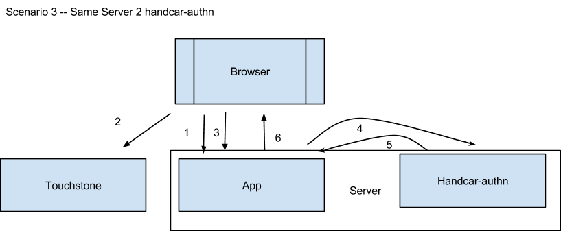
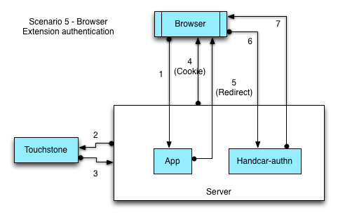
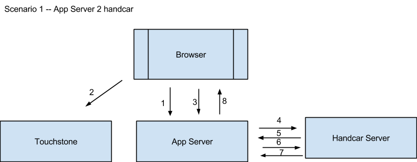

Two Authentication Mechanisms
=============================

There are two mechanisms for authenticating to Handcar.  One uses MIT’s
Touchstone to perform the authentication the other uses AGENT KEYS.
 Each has it’s own URL.  

-  The Touchstone one is
    `https://oki-dev.mit.edu/handcar-authn/services/learning/ <https://oki-dev.mit.edu/handcar-authn/services/learning/>`__

-  Note the “handar-authn” in the above url.   This url has been
   configured to require the user to log in via Touchstone.

-  The Agent Key one is
   `https://oki-dev.mit.edu/handcar/services/learning/ <https://oki-dev.mit.edu/handcar/services/learning/>`__

-  This url has been configured to allow any users to connect to the
   service as a GUEST “MC3GUE$T”.
-  Handcar then uses “agent keys” or tokens to identify users and grant
   access to it’s resources.  If you do not have any keys then you can
   enter only as a guest. (see below).

Which authentication mechanism should I use?
--------------------------------------------

It depends on how you are going to build and deploy your application.

Authentication Use Cases
~~~~~~~~~~~~~~~~~~~~~~~~

These use cases describe the different scenarios that we expect to
encounter.  We distinguish between whether the the HTTP request comes
from the same server that hosts the Handcar service, or a server remote
from the Handcar host server.

` <#>`__\ ` <#>`__

Different server than handcar

Same server as Handcar

Only Server calls handcar

Scenario 1

Scenario 3

Browser client makes AJAX calls directly to handcar

Scenario 2

Scenario 4

Scenario 1 -- The Application Server talks directly to handcar
~~~~~~~~~~~~~~~~~~~~~~~~~~~~~~~~~~~~~~~~~~~~~~~~~~~~~~~~~~~~~~

.. image:: images/image00.png

Scenario one describes an application server that manages MC3 data
directly on behalf of a user

#. User tries to access app
#. Gets routed to touchstone to get authenticated
#. Gets redirected back to the app
#. App uses it’s own application key to request from handcar a short
   lived agent key for the user
#. Handcar creates the key for the actual user and returns it to the app
#. App asks for the needed resources specifying that short lived agent
   key
#. Handcar sends back results
#. App sends results back to browser to display on the screen

Scenario 2 -- Application Server constructs key for user, sends to Browser so it can talk to Handcar
~~~~~~~~~~~~~~~~~~~~~~~~~~~~~~~~~~~~~~~~~~~~~~~~~~~~~~~~~~~~~~~~~~~~~~~~~~~~~~~~~~~~~~~~~~~~~~~~~~~~

.. image:: /images/image02.png

#. User tries to access app
#. Gets routed to touchstone to get authenticated
#. Gets redirected back to the app
#. App requests from handcar a short lived agent key for the user
#. Handcar creates the key for the actual user and returns it to the app
#. The app sends that key to the browser
#. Browser code uses that key to call handcar
#. Handcar replies back to the browser with request

Scenario 3 -- Application is running on same server as Handcar and talks to handcar server to server
~~~~~~~~~~~~~~~~~~~~~~~~~~~~~~~~~~~~~~~~~~~~~~~~~~~~~~~~~~~~~~~~~~~~~~~~~~~~~~~~~~~~~~~~~~~~~~~~~~~~

#. User tries to access app
#. Gets routed to touchstone to get authenticated
#. Gets redirected back to the app after getting authenticated
#. App on server requests makes request of handcar-authn using the
   user’s authentication

#. This happens automatically because the app and handcar-authn are both
   on the same server and share the session
#. TODO: verify that this actually works!

5. Handcar-authn returns the request back to the app
6. App sends the data to the browser

Scenario 4  -- application is running on same server as handcar and browser uses touchstone cookies to talk to handcar
~~~~~~~~~~~~~~~~~~~~~~~~~~~~~~~~~~~~~~~~~~~~~~~~~~~~~~~~~~~~~~~~~~~~~~~~~~~~~~~~~~~~~~~~~~~~~~~~~~~~~~~~~~~~~~~~~~~~~~

#. User tries to access app
#. Gets routed to touchstone to get authenticated
#. Gets redirected back to the app after getting authenticated
#. App sends java script code to browser
#. Code in browser calls handar-authn using the touchstone cookies and
   not using the agent key

#. User is already authenticated because they are on the same same
   server!

6. handcar-authn sends the data to the browser

Scenario 5  -- application is a browser extension and has access to
cross-domain cookies

For FireFox and Chrome browsers, extensions have access to cross-domain
cookies. This allows them to authenticate the user against a
Touchstone-enabled server (i.e. running handcar-authn), and then have
authenticated communications with an MC3 service. The MC3 Browser
Extension is one example of this.

#. Using the extension, user logs into the MC3 service. Browser
   extension sends an HTTP request to a redirect service running on the
   same server as the handcar-authn service. A query parameter should be
   included, which should be the current webpage the user is looking at.
   For example:

#. `https://mc3-demo.mit.edu/be\_auth/login?redirect\_url=www.google.com <https://mc3-demo.mit.edu/be_auth/login?redirect_url=www.google.com>`__

2. The Apache service running on the server intercepts this HTTP request
   and redirects the user to a Touchstone login screen. The user must
   log in with their Touchstone credentials.
3. The Touchstone service returns an authenticated user to the server.
   The username is embedded in the request header in the REMOTE\_USER
   field.
4. The Apache service on the server sets a session cookie and a
   Touchstone cookie on the user’s browser. The domain for this will
   match the handcar-authn service (i.e. mc3-demo.mit.edu).

2. The server-side redirect application also sets a cookie with the
   username of the user. This provides the browser extension with the
   username (for personalization).

5. The redirect application on the server then redirects the user’s
   browser window to the original webpage. This is transparent to the
   user.
6. The user can now use the browser extension to talk to handcar-authn,
   in an authenticated fashion. The browser automatically handles
   communications with handcar-authn and provides the Touchstone cookie
   as needed.

3. Note that the browser extension itself does not handle the Touchstone
   cookies. It only reads the cookies in order to tell if a user is
   logged in or not. Without the ability to read these cookies (like in
   Safari), the browser extension cannot detect if the user is
   authenticated against Touchstone and personalize the screen (i.e.
   change the Log In / Logged Out text).

7. Handcar-authn returns requested data to the user / browser extension.

Ok, my app can authenticate to handcar but how can I get Touchstone to authenticate users to my app?
----------------------------------------------------------------------------------------------------

If your application will run on the same server as handcar you don’t
have to do anything. We will configure your application to work with
touchstone.  If your application will run on a different server then it
is a more complicated process.  You need to work with MIT’s touchstone
people and the process involves creating and exchanging certificates.

See the `Developer support section in the Touchstone
FAQ <http://ist.mit.edu/web/touchstone/faqs#heading11>`__.

Authenticating to Handcar via Touchstone
----------------------------------------

The url is
 `https://oki-dev.mit.edu/handcar-authn/services/learning/ <https://oki-dev.mit.edu/handcar-authn/services/learning/>`__

Note the “handar-authn” in the above url.   This url has been configured
to required the user to log in via Touchstone.

When you access handcar via this URL it redirects you to the Touchstone
login site.  Once authenticated it includes in your HTTP requests
special “cookies” that authenticate you to the handcar service.

Can non-MIT users use my application?
~~~~~~~~~~~~~~~~~~~~~~~~~~~~~~~~~~~~~

They can access it as a guest, MC3GUE$T, but are limited to those
authorizations, (see below).   Currently only users with full MIT
credentials (Kerberos ids) can access MC3 fully.  This is a limitation
of the MIT Roles database which only accepts fully credentialed users.

What about Touchstone Collaboration accounts and InCommon accounts?
~~~~~~~~~~~~~~~~~~~~~~~~~~~~~~~~~~~~~~~~~~~~~~~~~~~~~~~~~~~~~~~~~~~

No.  Since these are not fully credentialed they cannot be granted any
authorizations in the roles database so they cannot access the system as
anything but as a guest.

Authenticating to Handcar using Agent Keys
------------------------------------------

When you go to the learning service via this URL
`https://oki-dev.mit.edu/handcar/services/learning/ <https://oki-dev.mit.edu/handcar/services/learning/>`__ 
it has configured to allow in any users to connect to the service as a
GUEST “MC3GUE$T”.  Handcar then uses “agent keys” or tokens to identify
users and grant access to it’s resources.  If you do not have any keys
then you can enter only as a guest. (see below).  Each agent key encodes
and encrypts two things:

#. an agent Id  -- typically an email address like
   `nwright@mit.edu <mailto:nwright@mit.edu>`__
#. an expiration date  -- A date/time stamp when the token will expire
   and can no longer be used to access handcar

What do these keys look like?
~~~~~~~~~~~~~~~~~~~~~~~~~~~~~

They are all prefixed by “AGENT\_KEY” followed by a long string of
gibberish, for example:

AGENT\_KEYS6joWZkxqzi5H3Mu3ULGfviSF92D7BO2oRkaFo0VL1LXTQ6X2qbHgX6VQ4wEn%2BIX

This is the key hrm%40.mit.edu that expired about an hour before I wrote
this so using this key SHOULD NOT work.

The token is created based on a secret encryption key that varies by
which server you are using.  Therefore you might need three different
keys:

#. One for our development tier: OKI-DEV
#. One for our user testing tier: MC3-DEMO
#. One for our production tier: MC3

Expiration Date
~~~~~~~~~~~~~~~

By default an agent key will expire 1 hour after it is issued.   After
that you will have to get a new one.  

TODO: Change handcar to automatically extend the expiration date to 15
minutes after last access.

When the key is generated you can optionally request it a longer
duration.

==> Warning: the keys are not saved permanently to disk so they will get
trashed if we have to recycle the server and become unusable even if the
expiration date has not passed.

Can anyone construct these keys?
~~~~~~~~~~~~~~~~~~~~~~~~~~~~~~~~

No only a handful of authorized people and applications can construct
these keys..

Applications can have keys too?
~~~~~~~~~~~~~~~~~~~~~~~~~~~~~~~

Yes applications themselves can have their own key and can be configured
to construct a key on behalf of a user. That is why it is called an
“agent key” and not just a “user key”.  Applications are often
authorized agents that can access the system to construct keys on behalf
of a real user who has logged into their application.

The sequence goes something like this:

#. End user logs into the application using some form of authentication
   (preferably MIT’s touchstone)
#. Application uses it’s own key to ask handcar to construct a new key
   just for the logged in user

#. handcar/services/authentication/agentkeys/{agentId}?duration={SSSS}?proxyname={application
   key}
#. See Handcar contractdoc `construct key for
   agent <https://oki-dev.mit.edu/handcar/contractdocs/HandcarAuthenticationService.html#HandcarAuthentication-constructKeyForAgent>`__

3. The application then uses that new key on behalf of the user to make
   calls to handcar

3. handcar/services/learning/XXXXXXXXXXX?proxyname={new key for user}

I’m writing an application, can I get an app key?
~~~~~~~~~~~~~~~~~~~~~~~~~~~~~~~~~~~~~~~~~~~~~~~~~

If the application is going to run on the same physical server as
Handcar you don’t need one. Touchstone authentication reaches across the
application boundaries.

If you do need an application key please contact
`handcar-help@mailman.mit.edu <mailto:handcar-help@mailman.mit.edu>`__

“Quasi” Permanent Keys
~~~~~~~~~~~~~~~~~~~~~~

We can also configure permanent keys with a fixed expiration date at
some point in the future, for example new years eve, 2013-12-31.  This
is done on a case by case basis.  In general only applications get these
quasi permanent keys but some power users have them as well.

==> Since this key needs to be kept SECRET it is dangerous to have it
last so long.

Note: These keys DO survive reboots of the server because they are
persisted each time from a hidden set of properties files.

Using Proxy Name to make an authenticated request
~~~~~~~~~~~~~~~~~~~~~~~~~~~~~~~~~~~~~~~~~~~~~~~~~

If you want to make an authenticated request you put the agent key into
the optional “proxyname” query parameter

        ?proxyname=AGENT\_KEYS6joWZkxqzi5H3Mu3ULGfviSF92D7BO2oRkaFo0VL1LXTQ6X2qbHgX6VQ4wEn%2BIX

Example #1 Construct an Agent for a user
~~~~~~~~~~~~~~~~~~~~~~~~~~~~~~~~~~~~~~~~

`https://oki-dev.mit.edu/handcar/services/authentication/agentkeys/nwright <https://oki-dev.mit.edu/handcar/services/authentication/agentkeys/nwright>`__

TODO: construct a curl example

Example #2 Check if an Agent Key is (still) valid
~~~~~~~~~~~~~~~~~~~~~~~~~~~~~~~~~~~~~~~~~~~~~~~~~

`https://oki-dev.mit.edu/handcar/services/authentication/agentkeys/check/active/AGENT\_KEYS6joWZkxqzi5H3Mu3ULGfviSF92D7BO2oRkaFo0VL1LXTQ6X2qbHgX6VQ4wEn%2BIX <https://oki-dev.mit.edu/handcar/services/authentication/agentkeys/check/active/AGENT_KEYS6joWZkxqzi5H3Mu3ULGfviSF92D7BO2oRkaFo0VL1LXTQ6X2qbHgX6VQ4wEn%2BIX>`__

TODO: construct a curl example
