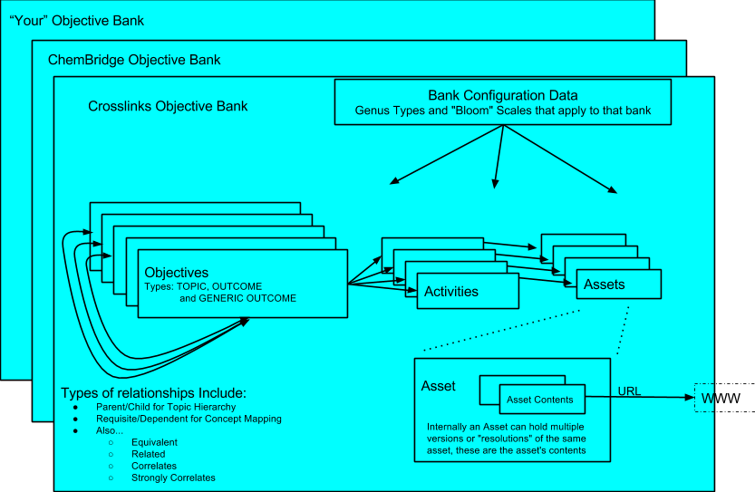

========
Overview
========

What is Handcar?
----------------
Handcar is a web service that provides a restful JSON interface to the MC3
system's learning objectives.  To learn more about MC3, see the 
`MC3 home page <http://mc3.mit.edu/home.html>`__ 

Known issues/Issues under consideration for implementation in future releases
-----------------------------------------------------------------------------

These items are known issues that are currently unsupported, but under consideration for
implementation in future releases.

#. Free form querying using keywords to find objectives
#. Managing the configuration data for a bank directly via Handcar
#. Providing a metadata so the UI can dynamically validate data values
#. Support for the Assessment service
#. Managing assets directly via a separate repository service
#. Support for additional asset content types (mime types)
#. Storage of additional information such as name, description or
   extensions on Parent-Child relationships
#. Getting branding information about a bank or an asset
#. Cross bank relationships will not be blocked in all situations but
   are not fully supported as many details remain to be worked out

Other Related Documentation
---------------------------

Detailed documentation on all of the methods and data elements is
contained in “Contract Docs” which fully explain the contract.

See
`http://mc3-demo.mit.edu/handcar/contractdocs/ <http://mc3-demo.mit.edu/handcar/contractdocs/>`__

--------------

Model Diagram
-------------

Model Description
-----------------

Banks contain three main types of objects:

-  `Objectives <objectives.html>`__-- Learning Objectives which come in 
   three distinct types:

    -  **Topics** -- also called concepts which define an area of knowledge ,
       typically expressed as NOUNS
    -  **Outcomes** -- which are specific learning goals, typically expressed
       starting with VERBS
    -  **Generic Outcomes** -- which are outcomes that hold no real data
       themselves but simply tie together topics and content
       via a Bloom type -- For example if the topic is “Derivative” a
       generic outcome could be “Learn Derivative”

-  `Activities <activities.html>`__ which are tied to objectives - that
   a student may do in order to master the objective
-  `Assets <assets.html>`__ which are tied to activities -- that are
   typically the content that a student consumes as part of the activity

-  In the model a single asset have multiple “Asset Contents” which may
   be different resolutions of the same asset, for example the same
   asset can have a thumbnail representation and full size JPG versions
   of the same picture.

-  `Relationships <https://mc3-demo.mit.edu/handcar/contractdocs/RelationshipBean.html>`__ --
   Alternative View of Relationships between objectives, see `The
   Relationship Service <relationships.html>`__

Additionally there are configuration “types” and “grade scales” used to
organize and categorize these three main objects.

For a detailed description of each of these objects and data fields see
the `Contract
Documentation <http://mc3-demo.mit.edu/handcar/contractdocs/>`__

Implementation Details
----------------------
Handcar is a Java Servlet that uses `Jersey <https://jersey.java.net/>`__ to generate a RESTful API.  It uses 
`Moxy <http://wiki.eclipse.org/EclipseLink/Examples/MOXy/MOXy_JSON_Provider>`__ to
serialize the objects into JSON.

